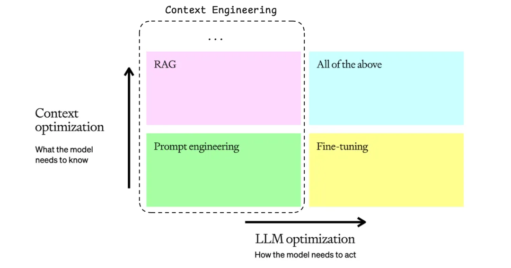

+++
date = '2025-09-25T22:10:00+08:00'
draft = false
title = "Context Engineering：系统性构建AI上下文架构"
description = "大多数AI Agent失败的根因不是模型能力，而是上下文工程的缺失。本文构建Context Engineering的完整理论框架与实现方法。"
categories = ['ai']
tags = ['Context Engineering', 'AI Architecture', 'System Design', 'LLM Engineering']
+++

## 核心论点

**大多数AI Agent的失败，本质上是上下文工程的失败，而非模型能力的不足。**

Context Engineering不是新的概念炒作，而是工业级AI系统开发中的必然演进。当我们将LLM视为一种新型计算范式时，上下文工程就是这个范式中的内存管理系统。

## I. 概念框架：Context Engineering的系统性定义

### 1.1 上下文的三维分类模型

传统理解将上下文等同于聊天历史，这是错误的。上下文是提供给LLM完成推理任务的全部信息集合，应按功能维度分类：

**指导性上下文（Guiding Context）**
- 功能：定义模型行为边界与执行框架
- 组成：System Prompt / Task Definition / Few-shot Examples / Output Schema
- 优化目标：Prompt Engineering的核心领域

**信息性上下文（Informational Context）**
- 功能：提供推理所需的事实、数据与知识
- 组成：RAG检索结果 / Memory系统 / State维护 / Scratchpad
- 优化目标：知识获取与存储效率

**行动性上下文（Actionable Context）**
- 功能：定义与外界交互的能力边界
- 组成：Tool Definition / Call History / Results Traces
- 优化目标：工具调用的准确性与连贯性

### 1.2 Context Engineering的精确定义

**Context Engineering是设计、构建并维护动态上下文管理系统的工程学科，该系统在Agent执行的每个时间步，智能地组装最优上下文组合，确保任务的可靠完成。**

### 1.3 与相关概念的层级关系

- **Prompt Engineering** ⊂ Context Engineering：专注于指导性上下文的优化
- **RAG** ⊂ Context Engineering：专注于信息性上下文的动态获取
- **Context Engineering**：统筹三类上下文的协调与优化

类比操作系统架构：
- **LLM = CPU**：执行计算任务
- **Context Window = RAM**：有限的工作内存
- **Context Engineering = Memory Manager**：智能的内存调度系统

## II. 必要性分析：为什么需要Context Engineering

### 2.1 失效模式分析

AI系统性能不足的根因分析表明，模型能力通常不是瓶颈，上下文信息的缺失或污染才是主要问题。

**示例：上下文贫乏 vs 上下文丰富**

输入："明天有空聚一下吗？"

**贫乏上下文系统**：
- 输出："感谢您的消息。我明天有空。请问您希望约在什么时间？"
- 问题：无法推进任务，需要人工干预

**丰富上下文系统**：
- 上下文组装：Calendar（明天已满）+ Contact（Jim，合作伙伴）+ History（非正式语气）+ Tools（日历邀请）
- 输出："Hi Jim! 明天日程已满。周四上午如何？已发送暂定邀请。"
- 结果：任务完成，无需额外交互

### 2.2 规模化挑战

简单的上下文累加策略在长程任务中必然失效：

**失效级联过程**：
1. **信号稀释**：关键信息被无关历史掩埋
2. **成本爆炸**：Token消耗呈线性增长
3. **系统崩溃**：超出Context Window限制

**解决方案**：智能上下文管理

通过压缩与选择性保留，维持上下文的高信噪比。

## III. 实现架构：Context Engineering的工程方法论

### 3.1 上下文退化的四种模式

- **Context Poisoning**：幻觉信息污染推理过程
- **Context Distraction**：无关信息干扰模型注意力
- **Context Confusion**：冗余信息降低输出准确性
- **Context Clash**：矛盾信息导致推理混乱

### 3.2 四维工程框架

**Write（写入）**
- Session-level：临时状态与草稿纸管理
- Persistent：长期记忆与知识积累
- 目标：超越Context Window限制的信息持久化

**Select（选取）**
- Deterministic：基于规则的上下文加载
- Model-driven：基于模型的智能筛选
- Retrieval-based：基于相似度的检索选择
- 目标：动态组装最相关信息

**Compress（压缩）**
- 有损压缩：保留核心信号，删除冗余细节
- 无损压缩：结构化表示与编码优化
- 目标：在有限空间内最大化信息密度

**Isolate（隔离）**
- 子系统隔离：通过专门Agent处理特定信息流
- 边界管理：控制信息传递的粒度与质量
- 目标：降低系统复杂性，提高信息质量

### 3.3 架构设计原则

**信息密度最大化**：每个Token都应承载有效信号
**动态适应性**：根据任务阶段调整上下文组合
**鲁棒性保证**：容错机制与降级策略
**可扩展性**：支持长程任务与复杂工作流

## IV. 结论与展望

Context Engineering标志着AI应用开发范式的根本转变：

**从** "寻找完美提示词" **到** "构建智能上下文管理系统"
**从** "模型调优" **到** "信息架构设计"
**从** "单点优化" **到** "系统工程"

### 技术趋势判断

1. **标准化协议**：MCP等标准将推动上下文接口的统一
2. **专用硬件**：上下文处理将催生专门的计算架构
3. **自适应系统**：AI系统将具备自主的上下文管理能力

### 实践建议

对于工程团队：
- 将上下文管理作为架构设计的第一优先级
- 建立系统化的上下文测试与评估机制
- 投资于长期的上下文基础设施建设

**最终判断：掌握上下文工程，是区分Demo与产品级AI应用的分水岭。**

---

## 参考资源

- [Tobi Lütke on Context Engineering](https://x.com/tobi/status/1935533422589399127)
- [Andrej Karpathy's Vision](https://x.com/karpathy/status/1937902205765607626)
- [Cognition AI: Multi-Agent Architecture](https://cognition.ai/blog/dont-build-multi-agents#principles-of-context-engineering)
- [Context Failure Analysis](https://www.dbreunig.com/2025/06/22/how-contexts-fail-and-how-to-fix-them.html)