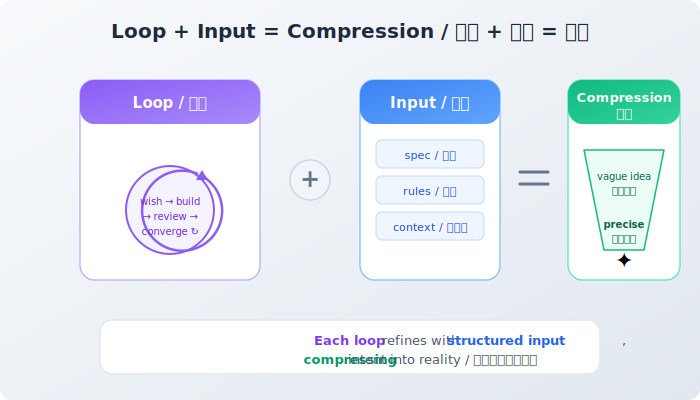
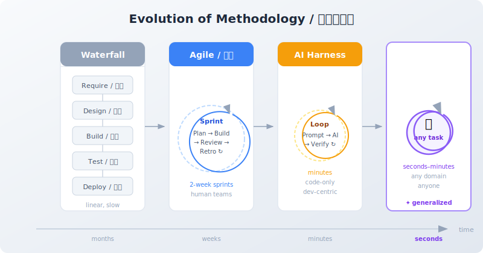

+++
date = '2026-03-27T10:00:00+08:00'
draft = false
title = 'Ruyi: As You Wish'
description = 'Define what you truly want and how to know when it is done. The rest is loops and compression. Ruyi turns decades of software methodology into a single command anyone can use.'
categories = ['AI']
tags = ['Ruyi', 'Claude Code', 'AI Tools', 'Autonomous Agent']
+++

## The Wall

You've had this moment. A clear idea in your head — a book, a website, a product, a research project — and between that idea and reality, there's an invisible wall.

It's not a talent problem. It's a tooling problem.

You want to write a novel but don't know how to typeset. You want to build a website but can't code. You want to validate a business idea but don't know where to start.

**You have the wish. You lack the path to fulfillment.**

## Wish and Fulfillment

In Chinese, "心想事成" (xīn xiǎng shì chéng) means "what the heart wishes, reality becomes." Break it apart:

- **心想 (Wish)**: What do you truly want? How do you know when it's done?
- **事成 (Fulfillment)**: The journey from intention to result.

Most tools solve pieces of fulfillment — they help you code, design, or format. But no tool solves the fundamental problem: **you define the wish, and fulfillment happens automatically.**

That's what [Ruyi](https://github.com/ZhenchongLi/ruyi) does.

## The Dumbest Method That Works

The core principle behind Ruyi is almost suspiciously simple:

> **Loop + Input = Compression**



You have a vague idea. Ruyi turns it into a precise result. Not through a single flash of genius, but through **relentless iteration**:

1. **Wish** — You describe what you want
2. **Build** — AI executes
3. **Review** — A separate AI evaluates the result
4. **Converge** — Refine based on feedback, loop again


Each loop brings the result closer to your wish. Like kneading dough — each fold makes the shape more precise.

This is compression. Compressing vague intent into precise reality.

**Is this method dumb? Yes. Is it effective? Extremely.** Because this is what AI fundamentally is — compression. As long as there's a loop and input, there's compression. No shortcuts needed. No magic required.

## From Waterfall to Agile to Ruyi



The software industry has spent decades solving one problem: **how to keep projects from spiraling out of control.**

Projects fail for one reason: **divergence**. Scope creeps, requirements shift, direction gets lost.

To fight divergence, the industry developed methodology after methodology:

- **Waterfall**: Plan everything upfront, then execute linearly. The problem — you can never plan everything upfront.
- **Agile**: Don't plan that far ahead. Every two weeks: plan, build, review, reflect. Effective, but requires an entire team.
- **AI Harness**: Replace the team with AI agents, shrink the loop to minutes. But still limited to coding.

Strip away the jargon, and every one of these is the same pattern: **do a little, check it, do a little more.** The dev-review loop.

Karpathy's [autoresearch](https://github.com/karpathy/autoresearch) proved this loop works for research — run experiments, evaluate, iterate until values converge. AI harnesses proved it works for coding.

Ruyi generalizes it: **the loop works for everything.**

## Why You Don't Need to Know How It Works

Under the hood, Ruyi uses git (version control), Claude Code (AI engine), dual-agent adversarial review, and a Racket-based safety layer.

You don't need to know any of that.

Just like you don't need to know how the chip in your phone works to make a call.

Previous AI tools share a common flaw: **they assume the user is technical.** You need to install software, use a terminal, understand what "git commit" means. These aren't ordinary skills — they're professional barriers.

Ruyi hides all of it. For you, there's exactly one thing:

```bash
ruyi do
```

Tell it what you want. It asks a few questions to clarify your wish. Then it works — building, reviewing, refining — until it's done.

## Who Ruyi Is For

Ruyi wasn't built for programmers (though programmers can use it too).

Ruyi was built for **people with ideas**:

- You're a **writer** who wants to turn a manuscript into a beautiful ebook site
- You're a **designer** who wants to turn a concept into a working prototype
- You're a **philosopher** who wants to structure thoughts into a coherent essay series
- You're an **entrepreneur** who wants to rapidly validate a product concept
- You're a **teacher** who wants to create personalized learning materials

What you all share: **you know what you want, but lack the toolchain to make it real.**

Ruyi is that toolchain. And it's the shortest one possible — just two words: `ruyi do`.

## Get Started

Set up a machine with [Claude Code](https://claude.ai/code), then:

```bash
# Install Ruyi
# Paste this into Claude Code:
# "Please install ruyi, refer to https://github.com/ZhenchongLi/ruyi"

# Then, as you wish
ruyi do
```

Ruyi will ask: what do you want to do?

Answer it. The loop handles the rest.

---

*Ruyi (如意) means "as you wish." Inspired by Andrej Karpathy's [autoresearch](https://github.com/karpathy/autoresearch) — using iterative convergence to solve research problems. Ruyi generalizes the idea: not just research, not just code, but anything with a clear goal.*

*Repository: [github.com/ZhenchongLi/ruyi](https://github.com/ZhenchongLi/ruyi)*
