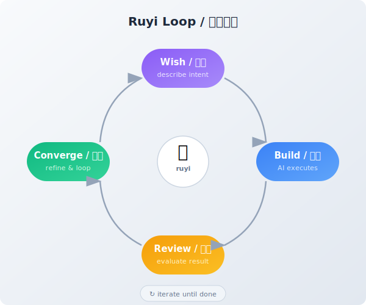

+++
date = '2026-03-27T10:00:00+08:00'
draft = false
title = '如意：心想事成的AI工具'
description = '定义好"心想"——你真正想做什么，如何判断做完。剩下的交给循环和压缩。如意把软件工程几十年沉淀的方法论，变成了任何人都能用的一条命令。'
categories = ['AI']
tags = ['Ruyi', 'Claude Code', 'AI Tools', 'Autonomous Agent']
+++

## 一个问题

你有没有过这样的时刻——脑子里有一个清晰的想法，但从想法到落地之间，隔着一堵看不见的墙？

这堵墙不是你的能力问题。它是工具的问题。

你想写一本小说，但你不会排版。你想做一个网站，但你不会写代码。你想验证一个商业想法，但你不知道从哪里开始。

**你有"心想"，但缺少"事成"的路径。**

## 心想事成

"心想事成"这四个字，拆开来看：

- **心想**：你真正想做什么？做完的标志是什么？
- **事成**：从想法到结果的过程。

大多数工具解决的是"事成"的某个环节——帮你写代码、帮你设计、帮你排版。但没有工具解决最根本的问题：**你只需要定义"心想"，"事成"自动发生。**

这就是[如意（Ruyi）](https://github.com/ZhenchongLi/ruyi)在做的事。

## 最笨的方法，最有效

如意背后的核心原理，简单到令人怀疑：

> **循环 + 输入 = 压缩**


什么意思？

你有一个模糊的想法。如意帮你把它变成精确的结果。怎么做到的？不是靠一次性的天才灵感，而是靠**反复循环**：

1. **心想** — 你描述你想要什么
2. **实现** — AI 去做
3. **审查** — 另一个 AI 检查做得怎么样
4. **收敛** — 根据反馈改进，再来一轮



每一轮循环，结果都离你的"心想"更近一步。就像揉面团——每揉一次，形状就更接近你要的样子。

这就是压缩。把模糊的意图，压缩成精确的现实。

**这个方法笨吗？笨。有效吗？极其有效。** 因为这就是AI的本质——压缩。只要有循环，有输入，就有压缩。不需要捷径，不需要魔法。

## 从瀑布到敏捷，再到如意


如果你不是程序员，你可能不知道软件行业几十年来一直在解决同一个问题：**如何让项目不失控。**

失控的原因只有一个：**发散**。做着做着就偏了，需求变了，方向迷了。

为了对抗发散，业界发展出了一套又一套方法论：

- **瀑布开发**：先想清楚所有事情，再一步步做。问题是——你不可能一开始就想清楚所有事。
- **敏捷开发**：别想那么远，每两周做一小轮——计划、开发、审查、回顾。有效，但需要一整个团队来执行。
- **AI Harness**：用 AI 替代团队中的执行角色，循环缩短到分钟级。但仍然只限于写代码。

这些方法论的核心，本质上都是同一个模式：**做一点，检查一下，再做一点。** 专业术语叫 dev-review 循环。

如意做了一件事：**把这个模式从软件开发中解放出来，让它为所有人所用。**

## 为什么你不需要知道它怎么做的

如意的底层用了 git（版本控制）、Claude Code（AI引擎）、双智能体对抗审查等一系列技术。

但这些你不需要知道。

就像你不需要知道手机里的芯片是怎么工作的，你只需要知道怎么打电话。

过去的 AI 工具有一个通病：**它们假设用户是技术人员。** 你得会装软件，会用命令行，会理解"git commit"是什么意思。这些不是普通人的技能，这是专业门槛。

如意把所有这些藏在后面。对你来说，只有一件事：

```bash
ruyi do
```

告诉它你想做什么，它会问你几个问题来确认你的"心想"，然后自己去做，自己检查，自己改进，直到完成。

## 谁应该用如意

如意不是给程序员写的（虽然程序员也能用）。

如意是给**有想法的人**写的：

- 你是一个**作家**，想把手稿变成一个精美的电子书网站
- 你是一个**设计师**，想把设计理念变成可以展示的原型
- 你是一个**哲学家**，想把思考整理成结构化的文章系列
- 你是一个**创业者**，想快速验证一个产品概念
- 你是一个**老师**，想为学生创建个性化的学习材料

你们的共同点：**你们都知道自己想要什么，但缺少把它变成现实的工具链。**

如意就是那个工具链。而且是最短的那条——只有两个字：`ruyi do`。

## 开始

准备好一台装了 [Claude Code](https://claude.ai/code) 的机器，然后：

```bash
# 安装如意
# 把下面这段话粘贴到 Claude Code 中：
# "请帮我安装 ruyi，参考 https://github.com/ZhenchongLi/ruyi"

# 然后，心想事成
ruyi do
```

如意会问你：你想做什么？

回答它。剩下的，交给循环。

---

*如意，取自"如你所愿"。灵感源自 Andrej Karpathy 的 [autoresearch](https://github.com/karpathy/autoresearch) 项目——用循环收敛来解决研究问题。如意将这个理念泛化：不只是研究，不只是编程，而是一切有明确目标的事。*

*项目地址：[github.com/ZhenchongLi/ruyi](https://github.com/ZhenchongLi/ruyi)*
