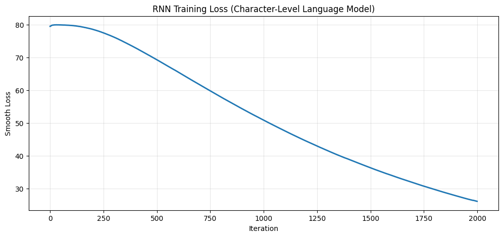
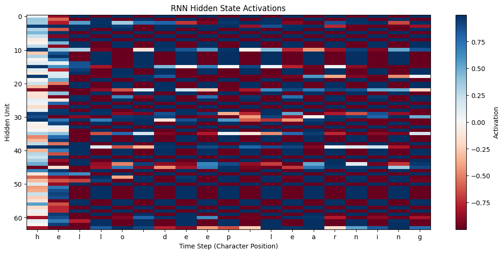

+++
date = '2026-04-15T15:00:00+08:00'
draft = false
title = 'Sutskever 30 #02：猜下一个字符，然后呢？'
description = '给模型一个最简单的任务——猜下一个字符。我们在 2490 个字符上跑了一遍，看看能长出什么。'
categories = ['AI', 'Sutskever 30']
tags = ['Sutskever 30', 'RNN', 'char-RNN', 'Language Modeling', 'Notebook Reading']
+++

## 一个任务

给你一串字符，猜下一个是什么。就这一个任务。

2015 年，Karpathy 拿这个任务训练了一个 RNN。训练完让它自己写，它写出了能编译的 C 代码。没人教它什么是函数、什么是括号——它只是被"猜下一个字符"反复训练，自己学会了这些。他把过程写成了一篇[博客](https://karpathy.github.io/2015/05/21/rnn-effectiveness/)，影响力比很多正式 paper 都大。

我们拿最小的版本跑了一遍。

## hello world

先看结果。这是我们的模型在第 1800 步生成的文本：

```
rmption is pattornnin

eell
n levery
ywormnearn data

hello world
helens pis prnters
```

`hello world` 完整地冒出来了，旁边还是一堆乱七八糟的东西。

这个模型的全部训练数据是 2490 个字符——几句英文短句复制 10 遍。hidden size 64，vanilla RNN，纯 NumPy 手写。它从来不知道 "hello world" 是一个词组。

那它怎么学会的？

模型每一步对 24 个字符各猜一个概率，加起来是 1。训练数据里有正确答案——比如 `h` 后面确实跟着 `e`。一开始模型给 `e` 的概率很低，可能 4%。

猜错了怎么办？算一个数：

$$\text{loss} = -\log(p)$$

$p$ 是模型给正确答案的概率。$-\log(0.04) \approx 3.2$，挺疼的。$-\log(0.9) \approx 0.1$，几乎没感觉。概率越低，这个数越大，惩罚越重。

为什么用 $\log$ 而不是更直觉的 $1 - p$？因为 $1 - p$ 是线性的：概率从 50% 降到 40%，惩罚增加 0.1；从 5% 降到 4%，惩罚也只增加 0.01。但模型已经很离谱了（5%）还能更离谱（4%），这种恶化应该更疼才对。$-\log(p)$ 做到了这一点——概率越低，曲线越陡，越错越疼。

然后梯度根据这个 loss 调权重，方向是"让 $e$ 的概率高一点"。下次再看到 $h$，$e$ 可能变成 8%，再下次 15%。训练数据里 "hello" 重复了 10 遍，这个方向被反复加强。

整个训练就是这个循环：


那 2000 步里发生了什么？

Iteration 0，纯噪音：

```
lvfaxhnugscfcuerxmmkgloyxvwlpwiyiorxesmftnpgloidxlsihiimmlcldcxopiwothxuvdeffv
```

Iteration 800，开始有词的影子——`llo`、`hearn`、`nearn`——但拼不对：

```
ormation pin
hearn
nearn ing nattavp reu llo
heern daarn
```



Smoothed loss 从 ~79 降到 ~30（EMA 0.999）。从噪音到影子到完整的词，都在这条曲线里。

## 64 个隐藏单元里发生了什么

把模型读 "hello deep learning" 时 64 个隐藏单元的激活值画出来：



有些单元在空格的位置有明显跳变。模型从来没被告知"空格是词的边界"，但为了更好地猜下一个字符，它的隐藏状态自己分化出了对空格敏感的单元。

2490 个字符的训练数据，64 个数字的记忆，长出了这些。

## 代码

完整 notebook 在 [ZhenchongLi/sutskever-30-reading](https://github.com/ZhenchongLi/sutskever-30-reading)，文件是 `02_char_rnn_karpathy.ipynb`。

整个 RNN 的 forward pass：

```python
hs[t] = np.tanh(
    np.dot(self.Wxh, xs[t]) +
    np.dot(self.Whh, hs[t-1]) +
    self.bh
)
ys[t] = np.dot(self.Why, hs[t]) + self.by
ps[t] = np.exp(ys[t]) / np.sum(np.exp(ys[t]))
```

RNN 和普通网络的区别就一处——它把上一步的状态传给下一步，形成循环，所以叫 "recurrent"。`Whh` 就是干这件事的矩阵：把上一步的 hidden state（64 个数字，相当于短期记忆）喂给当前步。读到 `h-e-l` 的时候，`l` 这一步的记忆里已经有 `h` 和 `e` 的痕迹——它不是只看当前字符在猜，是带着记忆在猜。

这个记忆就靠 `Whh` 一个矩阵——64×64，4096 个数字，装着模型从 2490 个字符里学到的所有东西。

反向传播也是手写的，梯度往回传 25 步（truncated BPTT），超过 ±5 就裁掉：

```python
for dparam in [dWxh, dWhh, dWhy, dbh, dby]:
    np.clip(dparam, -5, 5, out=dparam)
```

生成时从一个种子字符开始，每步按概率抽：

```python
h = np.tanh(np.dot(self.Wxh, x) + np.dot(self.Whh, h) + self.bh)
y = np.dot(self.Why, h) + self.by
p = np.exp(y) / np.sum(np.exp(y))
ix = np.random.choice(range(self.vocab_size), p=p.ravel())
```

第一次读这个代码有点意外——原来一个 RNN 拆开就这么点东西。

## Karpathy 看到的

| | Karpathy 原文 | 这个 notebook |
|---|---|---|
| 模型 | multi-layer LSTM | vanilla RNN |
| 数据 | Shakespeare / C code / LaTeX | 几句短句 ×10 |
| hidden size | 512+ | 64 |
| 现象 | 引号配对、缩进、公式环境 | 局部词和短语 |

同样是"猜下一个字符"，Karpathy 的模型学会了长距离结构——括号配对、缩进层级、LaTeX 公式环境。我们的只学到了局部的词和短语。压力是同一种压力，但承受压力的容器大小不同。

他写那篇博客的时候是 2015 年。十年后，GPT 系列把同样的直觉推到了完全不同的尺度上。起点都是同一个：next token prediction。

---

### Run Metadata

- repo: [ZhenchongLi/sutskever-30-reading](https://github.com/ZhenchongLi/sutskever-30-reading) @ `e03e44e`
- notebook: `02_char_rnn_karpathy.ipynb`
- Python `3.13.2` / NumPy `2.4.4` / Matplotlib `3.10.8`

### 怎么跑

```bash
cd ~/code/sutskever-30-implementations
jupyter lab 02_char_rnn_karpathy.ipynb
```

选 kernel `Python (sutskever-30)`。开头应该看到 `Data length: 2490`、`Vocabulary size: 24`、`Model initialized with 64 hidden units`。

### 备注

- Loss 走势 `~79 -> ~58 -> ~30` 是 smoothed 的（EMA 0.999）
- BPTT 是 truncated 的，seq_length=25
- Notebook 自己的 Key Takeaways 里提到了 temperature，但代码里 `sample()` 没有 temperature 参数——文档 bug

---

Powered by Joe, Weaver, Ruyi & Thorn.
