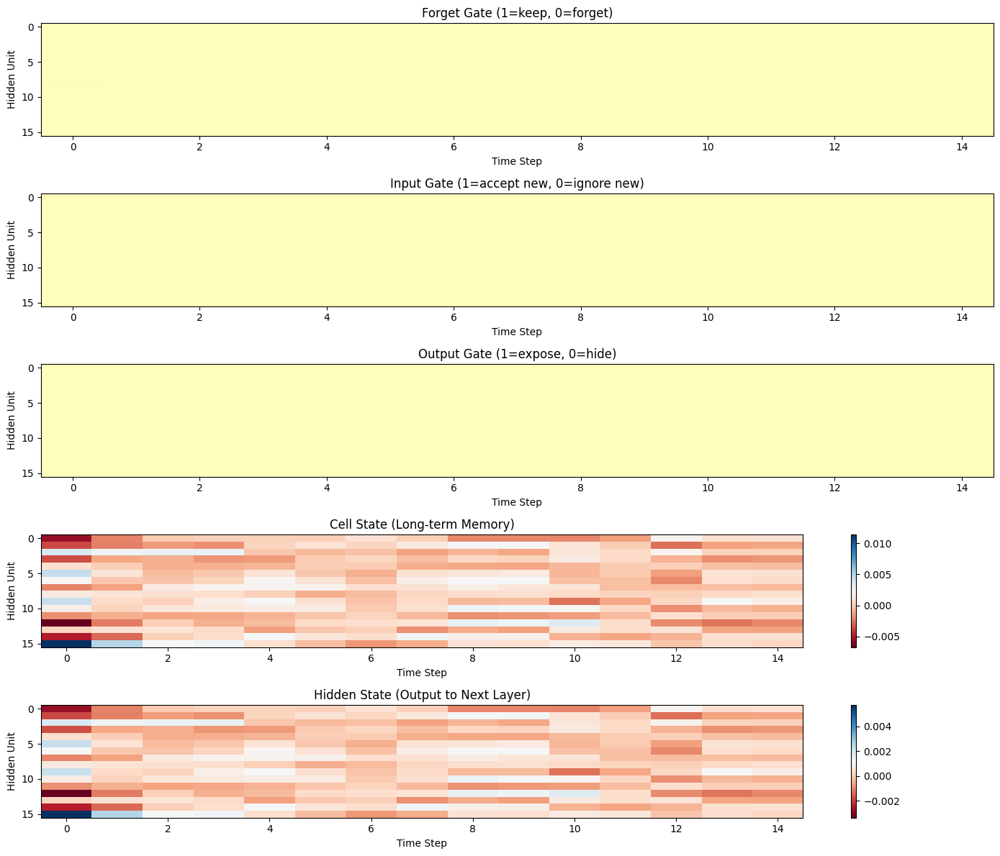
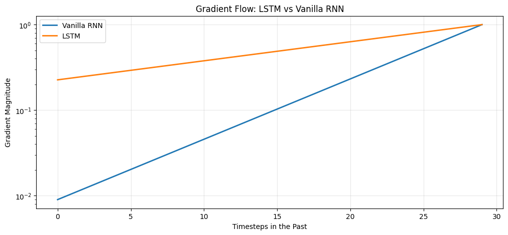
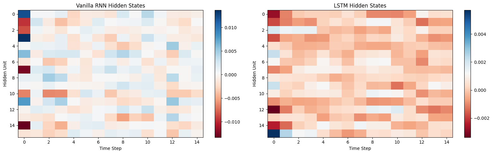

+++
date = '2026-04-16T08:00:00+08:00'
draft = false
title = 'Sutskever 30 #03：记忆为什么会漏，LSTM 怎么堵的？'
description = 'RNN 每一步都在做矩阵连乘，记忆越传越淡。LSTM 开了一条加法的路，记忆可以一站站传下去。'
categories = ['AI', 'Sutskever 30']
tags = ['Sutskever 30', 'LSTM', 'RNN', 'Gate Mechanism', 'Notebook Reading']
+++

## 上一篇留下的问题

[上一篇](/posts/ai/sutskever-02-char-rnn/)里，我们用一个 vanilla RNN 在 2490 个字符上跑出了 `hello world`。但那个模型的记忆只有 25 步——再远的东西它就看不到了。

一个自然的想法是：那把记忆加大呢？64 个隐藏单元不够，换 1000 个，换 10000 个。

没用。白板再大也没用。

## 乘法效应

vanilla RNN 每一步做的是：把旧状态和新输入混在一起，过一个 tanh。这个操作是乘法性质的——旧状态被一个矩阵乘一次、压一次。连续做 30 步，就是连乘 30 次。

$0.9^{30} \approx 0.04$

哪怕每次只损失 10%，30 步之后只剩 4%。每一步都在把之前写的东西乘以一个小于 1 的数，越乘越淡。白板开到多大都一样。

训练的时候也一样。梯度要从最后一步往回传，告诉前面的参数"你该记住什么"。每往回传一步，信号就乘一次，30 步之后信号几乎为 0。学习信号传不到那么远，模型就学不到"30 步之前发生了什么"。

这就是梯度消失。连乘带来的衰减，是 vanilla RNN 记不远的根本原因。

## LSTM：开一条加法的路

LSTM 的做法是，在乘法链旁边开了一条加法通道。

它多了两样东西：一条独立的记忆线路（cell state），和三个控制记忆流动的开关。

三个开关在每一步都问三个问题：

1. **忘记开关（forget gate）**：旧记忆里哪些要继续留着，哪些可以扔掉？
2. **写入开关（input gate）**：新信息要不要写进记忆？写多少？
3. **输出开关（output gate）**：记忆里的东西，这一步要拿多少出来用？

每个开关输出一个 0 到 1 之间的数。1 就是全开，0 就是全关。

代码里长这样：

```python
# 忘记开关
f = sigmoid(np.dot(self.Wf, concat) + self.bf)

# 写入开关
i = sigmoid(np.dot(self.Wi, concat) + self.bi)

# 新信息候选
c_tilde = np.tanh(np.dot(self.Wc, concat) + self.bc)

# 更新记忆：旧的留一部分 + 新的写一部分
c_next = f * c_prev + i * c_tilde

# 输出开关
o = sigmoid(np.dot(self.Wo, concat) + self.bo)
h_next = o * np.tanh(c_next)
```

关键是这一行：

$$c_{next} = f \cdot c_{prev} + i \cdot \tilde{c}$$

旧记忆乘以忘记开关，新信息乘以写入开关，**加**在一起就是新的记忆。只要忘记开关接近 1，旧记忆就近乎原样传过去。梯度沿着这条加法路径回传的时候，也不需要连乘矩阵了——信号可以一站一站地传下去，不衰减。这条路径有个名字，叫 "constant error carousel"。

vanilla RNN 没有这条路。它的更新是 $h_{next} = \tanh(W \cdot [x, h_{prev}])$——旧状态和新输入直接混在一起，记忆、计算、输出全挤在同一条线上。LSTM 把存信息和用信息分成了两条线。

## LSTM 多了一块保存记忆的空间

我们在 notebook 里设了一个小测试：一个长度为 15 的序列，第一个位置放一个重要的数字，后面 14 个全是随机噪音。任务是在最后一步记住第一个数字。

LSTM 理论上可以这么做：第一步打开写入开关，中间 14 步忘记开关保持 1（留着）、写入开关关掉（不写新东西），最后一步输出开关打开。噪音进来了，但 cell state 不受影响。

vanilla RNN 做不到这个——它没有独立的记忆空间，每来一个新输入，旧状态就被矩阵搅一遍，想保留也保留不了。

这是 16 个隐藏单元处理这个序列时，三个开关和记忆状态的热力图：



五张图从上到下：忘记开关、写入开关、输出开关、cell state（长期记忆）、hidden state（输出）。

这是一个没训练过的模型，开关的值还是随机的（上面三张 gate 图颜色均匀就是因为这个）。LSTM 提供了保存记忆的空间和控制记忆的开关，训练之后，这些开关会被梯度调到有意义的位置——该记什么、该忘什么，是 loss 收敛过程中学出来的。

## 开关不知道什么是"重要"

你可能会问：开关怎么知道该记什么、该忘什么？

开关的计算就是一个矩阵乘法加 sigmoid：$f = \sigma(W \cdot [x_t, h_{t-1}])$。出来的数只是一个数学运算的结果。

训练做的事是反复调那个 W 矩阵里的数字，让最后的 loss 变小。调了几千次之后，W 变成了一组特定的值，使得某种模式的输入进来时，开关恰好打开或关闭。

我们看到这个行为，说"模型学会了判断什么重要"。其实"重要"从来没有被定义过。被量化的只有 loss——猜对了还是猜错了，错了多少。所有看起来像智能判断的行为，都是 loss 收敛的副产物。

## 乘法 vs 加法



这是一个模拟（decay factor 0.85 vs forget gate 0.95）：30 步之后，vanilla RNN 的梯度只剩 0.009——几乎为零，意味着模型已经"忘了"最开始有什么。LSTM 的梯度还有 0.23，最初的记忆还在。真实训练也是这样，加法路径比连乘路径更不容易衰减。

同一个序列用两种模型处理，hidden state 的区别也很明显：



左边是 vanilla RNN，右边是 LSTM。LSTM 的不同单元在不同时间步有明显不同的反应——有的活跃、有的安静、有的在特定位置突然变化。这种分化说明不同单元开始各自负责不同的事情，是模型产生内部分工的体现。vanilla RNN 所有信息混在一起走，状态看起来更均匀，分不出谁在干什么。

## 这条路走到哪了

LSTM 是 1997 年提出来的。它解决了 vanilla RNN 记不远的问题，然后统治了序列建模将近二十年。Karpathy 2015 年那篇 char-RNN 博客用的就是 LSTM。

但 LSTM 还有两个没解决的东西：

**它还是一步步处理的。** 第 1 个 token 处理完才能处理第 2 个。序列很长的时候，速度很慢。

**开关是人设计的。** 忘记、写入、输出——这三个开关是 Hochreiter 和 Schmidhuber 坐下来想"记忆应该怎么流动"，然后手工设计的。这是人类对记忆机制的一种猜测。猜得不错，但终归是猜。

有没有一种方法，既不需要一步步传，又不需要人来设计记忆该怎么流动？

二十年后有人给出了答案。那是后面的故事。

## 和上一篇的关系

| | #02 char-RNN | #03 LSTM |
|---|---|---|
| 模型 | vanilla RNN | LSTM |
| 记忆更新 | $h = \tanh(W \cdot [x, h])$ | $c = f \cdot c_{prev} + i \cdot \tilde{c}$ |
| 核心区别 | 乘法链，信息指数衰减 | 加法通道，信息近似保持 |
| 关键限制 | 记不远 | 还是顺序处理，开关是人设计的 |

上一篇跑了一个完整的训练循环，这一篇把 LSTM 的内部结构拆开看。

## 代码

完整 notebook 在 [ZhenchongLi/sutskever-30-reading](https://github.com/ZhenchongLi/sutskever-30-reading)，文件是 `03_lstm_understanding.ipynb`。

跟上一篇一样，所有代码都是 NumPy 手写的——sigmoid、LSTM cell、forward pass、gate 计算，每一步都看得到。这个 notebook 没有训练循环（上一篇有），重点是看 LSTM 的内部结构和 gate 的行为。

---

### Run Metadata

- repo: [ZhenchongLi/sutskever-30-reading](https://github.com/ZhenchongLi/sutskever-30-reading)
- notebook: `03_lstm_understanding.ipynb`
- Python `3.13.2` / NumPy `2.4.4` / Matplotlib `3.10.8`

### 怎么跑

```bash
cd ~/code/sutskever-30-implementations
jupyter lab 03_lstm_understanding.ipynb
```

选 kernel `Python (sutskever-30)`。

### 备注

- 这个 notebook 没有训练循环，重点是 LSTM 结构和 gate 可视化
- 梯度对比图是模拟的（decay factor 0.85 vs forget gate 0.95），不是真实训练的梯度。Vanilla RNN: 0.008977, LSTM: 0.225936
- Christopher Olah 的[原文](https://colah.github.io/posts/2015-08-Understanding-LSTMs/)是理解 LSTM 最好的入门资料
