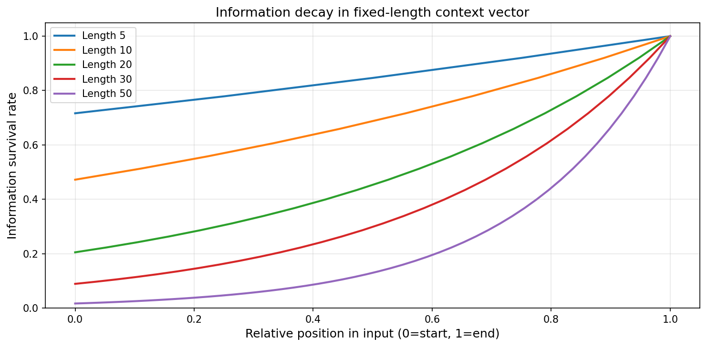
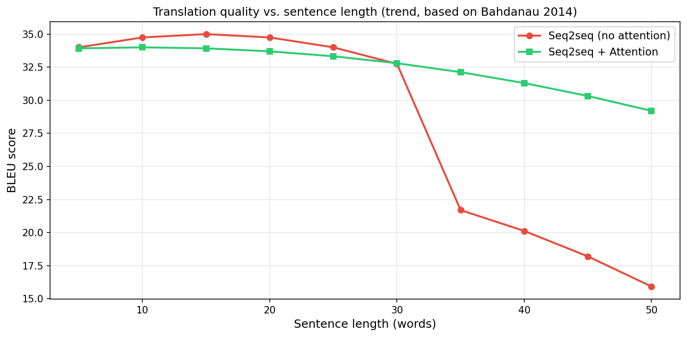
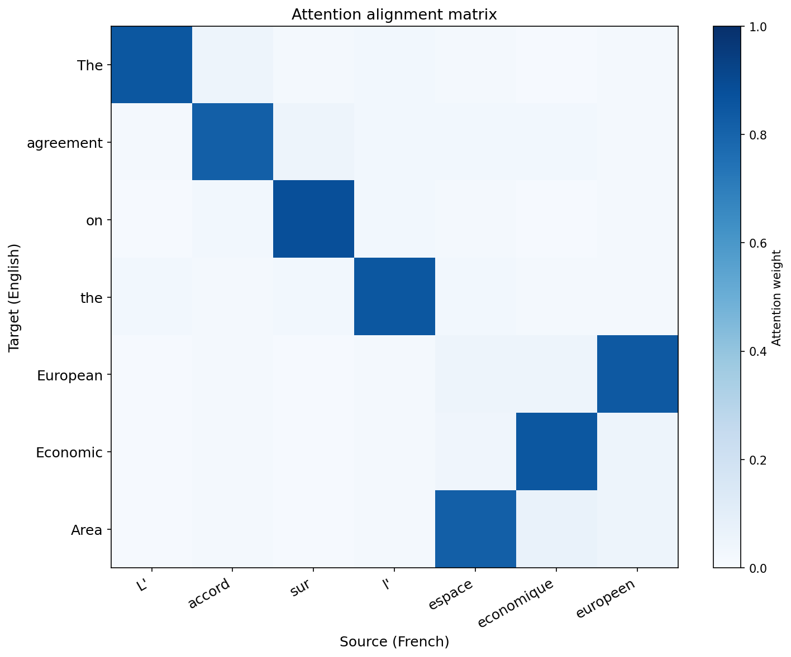
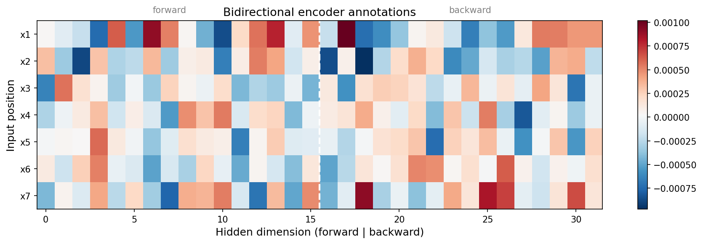
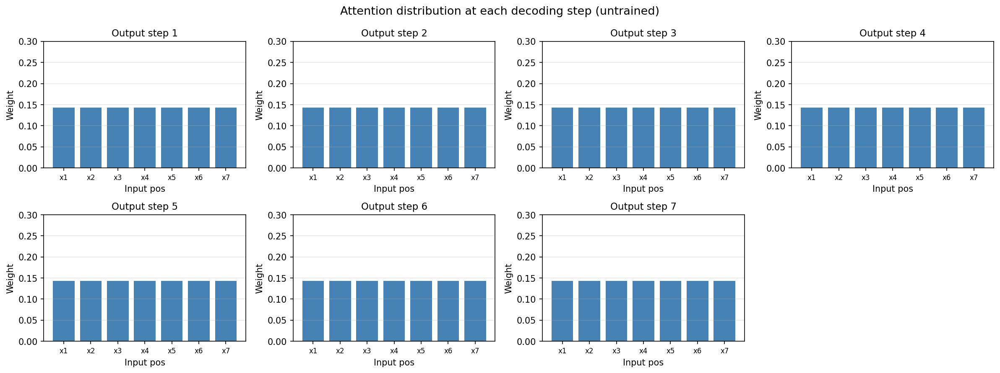
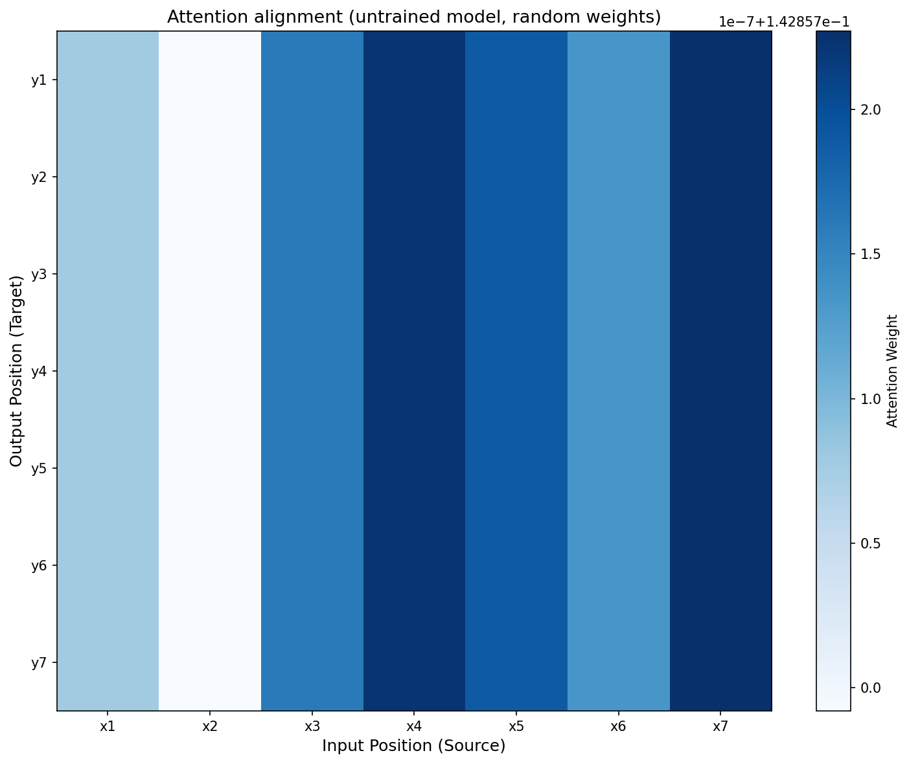
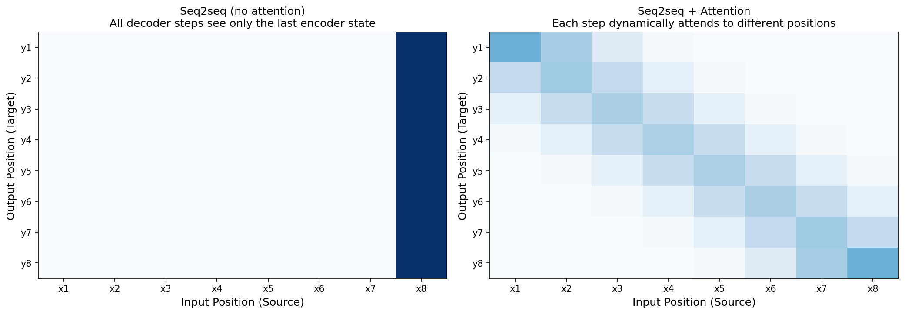

+++
date = '2026-04-17T10:00:00+08:00'
draft = false
title = 'Sutskever 30 #04：记住了，然后呢？'
description = 'LSTM 解决了记忆问题。但光记住还不够——你得把一个序列变成另一个序列。Seq2seq 做的就是这件事，而它的瓶颈催生了 attention。'
categories = ['AI', 'Sutskever 30']
tags = ['Sutskever 30', 'Seq2seq', 'Attention', 'Encoder-Decoder', 'Notebook Reading']
+++

## 上一篇留下的问题

[上一篇](/posts/ai/sutskever-03-lstm/)里，LSTM 解决了 vanilla RNN 记不远的问题——加法通道让梯度不再衰减，记忆可以跨越几十步传下去。

但我们一直在做同一件事：给定一个序列，预测下一个 token。输入和输出共享同一个时间线——第 1 步输入产生第 1 步输出，第 2 步输入产生第 2 步输出。

现实世界的很多任务不是这样的。翻译：一句中文进去，一句英文出来，长度不同，语序不同。摘要：一段话进去，一句话出来。对话：一个问题进去，一个回答出来。

输入是一个序列，输出是另一个序列。长度可以不同，结构可以不同。怎么办？

## 两个 LSTM，一根管子

2014 年，Sutskever、Vinyals 和 Le 提出了一个极简的方案：用两个 LSTM，中间接一根管子。

**Encoder**：一个 LSTM，把输入序列从头读到尾。读完之后，最后一步的 hidden state 就是整个输入的"总结"——一个固定长度的向量。

**Decoder**：另一个 LSTM，拿到这个向量作为初始状态，一个 token 一个 token 地生成输出。

就这么简单。输入和输出可以不同长度，因为 encoder 把任意长度的输入压缩成一个固定长度的向量，decoder 从这个向量展开成任意长度的输出。

代码的核心就几行（这里用简化的 RNN 展示结构，实际论文用的是 LSTM——gate 的细节[上一篇](/posts/ai/sutskever-03-lstm/)讲过了）：

```python
# Encoder：读完整个输入，拿到最后的 hidden state
h = np.zeros((hidden_size, 1))
for x in input_sequence:
    concat = np.vstack([x, h])
    h = np.tanh(np.dot(W_enc, concat) + b_enc)

context = h  # 这就是"总结"——整个输入压缩成一个向量

# Decoder：从 context 开始，逐步生成输出
h = context
for t in range(max_output_length):
    concat = np.vstack([prev_output, h])
    h = np.tanh(np.dot(W_dec, concat) + b_dec)
    output = np.dot(W_out, h) + b_out
    prev_output = output
```

这个架构有个名字——encoder-decoder，也叫 seq2seq（sequence to sequence）。它是 Sutskever 自己的工作，发表时直接打破了法语-英语翻译的最佳纪录。

## 一个反直觉的发现

论文里有一个很有意思的实验细节：把输入序列**倒过来**读，效果更好。

"Je suis étudiant" 不按 "Je → suis → étudiant" 的顺序输入，而是按 "étudiant → suis → Je" 的顺序。

为什么？因为 encoder 读完之后只保留最后一步的 hidden state。如果正着读，"Je"（第一个词）离 context vector 最远，信息衰减最严重。倒着读的话，"Je" 变成最后一个输入，信息最新鲜——而翻译的时候，"I"（对应 "Je"）恰好是 decoder 需要最先生成的词。

这个 trick 管用，但本身就暴露了一个问题。

## 瓶颈

把整个输入序列压缩成一个固定长度的向量——不管输入有 5 个词还是 50 个词，encoder 输出的向量维度是一样的。这就是信息瓶颈。



这张图模拟了信息衰减：序列越长，开头的词存活到最终向量的比例越低。长度为 50 的序列，第一个词的信息存活率不到 2%。

在翻译任务上的直接表现是：短句子翻得不错，长句子翻得越来越差。



没有 attention 的 seq2seq，句子超过 20-30 个词之后，BLEU 分数断崖式下降。信息塞不进一个向量里——向量的容量有限，但信息没有上限。

## Attention：让 decoder 回头看

2014 年，Bahdanau、Cho 和 Bengio 提出了解决方案：不要只给 decoder 一个"总结"，让它在每一步都能回头看整个输入。

具体做法：

1. Encoder 不再只保留最后一步的状态——保留**每一步**的 hidden state，叫 annotations：$h_1, h_2, ..., h_T$
2. Decoder 在生成每个输出词的时候，先看一眼所有的 annotations，决定这一步该重点关注哪些位置
3. 根据关注程度加权求和，得到一个专属于这一步的 context vector

"关注程度"怎么算？Bahdanau 用了一个小网络来打分：

$$e_{ij} = v_a^T \tanh(W_a s_{i-1} + U_a h_j)$$

$s_{i-1}$ 是 decoder 上一步的状态，$h_j$ 是 encoder 第 $j$ 步的状态。这个分数衡量的是"decoder 当前想要的东西"和"encoder 第 $j$ 步存的东西"有多匹配。

分数过 softmax 变成权重，权重乘以 annotations 求和，就是 context：

$$\alpha_{ij} = \frac{\exp(e_{ij})}{\sum_k \exp(e_{ik})}$$

$$c_i = \sum_j \alpha_{ij} h_j$$

代码里长这样：

```python
class BahdanauAttention:
    def forward(self, decoder_hidden, encoder_annotations):
        scores = []
        for h_j in encoder_annotations:
            # 打分：decoder 当前状态和 encoder 每一步的匹配度
            score = np.dot(self.v_a, np.tanh(
                np.dot(self.W_a, decoder_hidden) +
                np.dot(self.U_a, h_j)
            ))
            scores.append(score[0, 0])

        # softmax 变成权重
        attention_weights = softmax(np.array(scores))

        # 加权求和
        context = sum(alpha * h for alpha, h in
                      zip(attention_weights, encoder_annotations))
        return context, attention_weights
```

每一步 decoder 都做一次这个操作。翻译第一个词的时候，可能重点看输入的开头；翻译最后一个词的时候，可能重点看输入的结尾。不同的输出步骤看不同的位置——这就是 attention。

## 对齐

Attention 有一个副产品：对齐矩阵。



这是一个法译英的对齐矩阵（模拟数据）。横轴是法语输入，纵轴是英语输出。颜色越深，attention 权重越大。

可以看到大致的对角线结构——"L'" 对应 "The"，"accord" 对应 "agreement"。但不是严格的对角线：法语的 "espace économique européen" 对应英语的 "European Economic Area"，语序反了过来，attention 也跟着反了。

以前的机器翻译需要一个独立的对齐模型（alignment model），手动处理语序差异。Attention 把对齐和翻译合成了一件事——模型自己学会了"看哪里"。

## 跑一遍看看

我们用 notebook 里的模型跑了一遍。输入序列 [1, 2, 3, 4, 5, 6, 7]，encoder 是双向 RNN，decoder 每一步做一次 attention。模型没有训练过（随机权重），看的是 attention 机制本身的结构。

首先是 encoder 的输出——双向 annotations：



左半边是正向 RNN 的 hidden state，右半边是反向 RNN 的。每一行是一个输入位置，颜色是 hidden state 的值。双向拼起来，每个位置都同时包含了"前面的上下文"和"后面的上下文"。

然后是 decoder 每一步的 attention 分布：



没训练的模型，attention 分布还是接近均匀的——每个位置的权重差不多。训练之后，这些分布会变得尖锐，集中在该关注的位置上。

完整的 attention 矩阵：



和理想的对齐矩阵（下面那张）对比，就能看出训练前后的区别：

## 瓶颈 vs. 直连



左边是没有 attention 的 seq2seq：所有 decoder 步骤都只能看到最后一个 encoder 状态。右边是加了 attention 的 seq2seq：每一步都可以看所有 encoder 状态，权重各不相同。

一个是把整本书读完了复述，另一个是翻译的时候随时翻回去查原文。后者显然更好。

## 这条路怎么走到 Transformer 的

Seq2seq + attention 解决了瓶颈问题，但 encoder 和 decoder 本身还是 LSTM——还是一步一步顺序处理，还是人工设计的三个门。

Attention 机制本身倒是没有这些限制。它不关心 hidden state 是怎么来的——你给它一组 key-value 对和一个 query，它就能算出该关注哪些。

2017 年，有人把这个观察推到了极致：如果 attention 本身就够强，为什么还需要 RNN？把 LSTM 全部去掉，只留 attention。

那篇论文的标题是"Attention Is All You Need"。

但那是后面的故事。这一篇讲的是：一个看似简单的 encoder-decoder 架构，加上一个"让 decoder 回头看"的 attention 机制，就从"记住了"走到了"能翻译了"。而 attention 这个配角，后来变成了主角。

## 和上一篇的关系

| | #03 LSTM | #04 Seq2seq + Attention |
|---|---|---|
| 任务 | 单序列预测（下一个 token） | 序列到序列（翻译、摘要） |
| 核心问题 | 记不住远处的信息 | 输入长了装不进一个向量 |
| 解决方案 | 加法通道（cell state） | 每一步回头看所有输入（attention） |
| 关键限制 | 顺序处理，三个门是人设计的 | 还是用 LSTM，还是顺序处理 |

上一篇解决了"记住"，这一篇解决了"用记住的东西干活"。

## 代码

完整 notebook 在 [ZhenchongLi/sutskever-30-reading](https://github.com/ZhenchongLi/sutskever-30-reading)，文件是 `14_bahdanau_attention.ipynb`。

Encoder 是双向 RNN（正着读一遍、倒着读一遍，拼起来），decoder 每一步都做一次 attention。所有代码 NumPy 手写。

---

### Run Metadata

- repo: [ZhenchongLi/sutskever-30-reading](https://github.com/ZhenchongLi/sutskever-30-reading)
- notebook: `14_bahdanau_attention.ipynb`
- Python `3.13.2` / NumPy `2.4.4` / Matplotlib `3.10.8`

### 怎么跑

```bash
cd ~/code/sutskever-30-implementations
jupyter lab 14_bahdanau_attention.ipynb
```

选 kernel `Python (sutskever-30)`。

### 备注

- Sutskever et al. 2014 "Sequence to Sequence Learning with Neural Networks" 是 seq2seq 的原始论文
- Bahdanau et al. 2014 "Neural Machine Translation by Jointly Learning to Align and Translate" 加入了 attention
- 两篇论文同年发表，但解决的问题是递进关系：先有瓶颈，再有解法
- BLEU 趋势图是示意图，基于论文中的趋势，非精确数据
- Attention alignment 是模拟数据，展示理想情况下的对齐模式

---

$$\text{article}^* = \underset{\theta}{\arg\min}\ \mathcal{L}_{\text{lizcc}}(\theta), \quad \theta \in \lbrace\text{Joe, Weaver, Ruyi, Thorn}\rbrace$$
