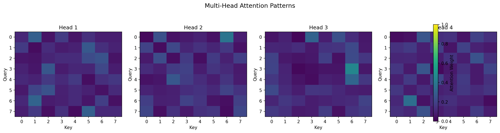
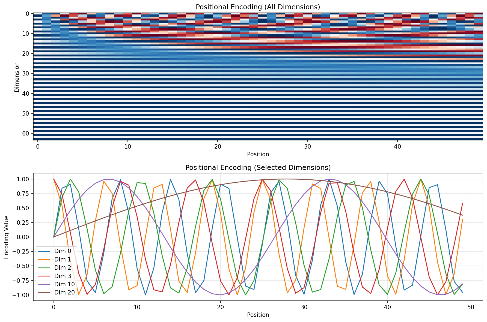
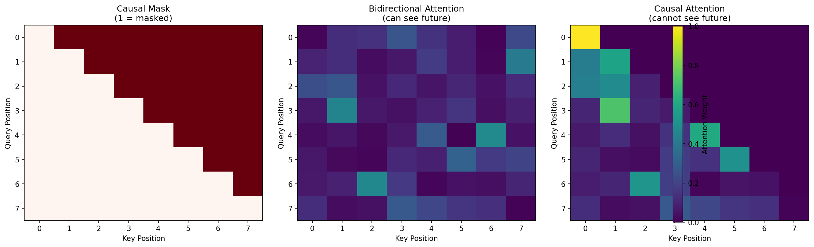
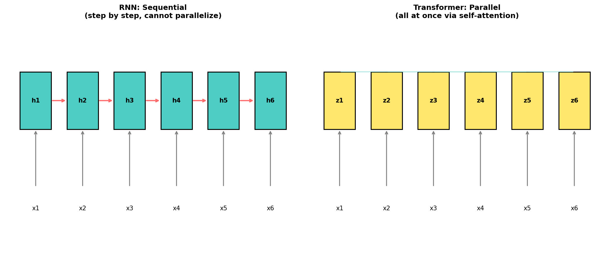

+++
date = '2026-04-17T16:00:00+08:00'
draft = false
title = 'Sutskever 30 #05：把 RNN 全部扔掉'
description = 'Attention 在 seq2seq 里是配角。2017 年有人问了一个问题：如果 attention 就够了，为什么还要 RNN？答案是 Transformer。'
categories = ['AI', 'Sutskever 30']
tags = ['Sutskever 30', 'Transformer', 'Self-Attention', 'Multi-Head Attention', 'Positional Encoding', 'Notebook Reading']
+++

## 上一篇留下的线索

[上一篇](/posts/ai/sutskever-04-seq2seq/)结尾说了一句话：attention 这个配角，后来变成了主角。

Seq2seq + attention 的架构里，LSTM 负责处理序列，attention 负责让 decoder 回头看。两者各司其职。但有一个问题一直没解决——LSTM 是顺序处理的。第 1 个词处理完才能处理第 2 个，第 2 个处理完才能处理第 3 个。

100 个词的句子，要跑 100 步。前一步没算完，后一步就不能开始，所以很难把 GPU 并行用满。

Attention 本身没有这个限制。它一次看所有位置，一次算完所有权重。

2017 年，Vaswani 等人把这个观察推到了极致：把 LSTM 全部去掉，只留 attention。

论文标题：[“Attention Is All You Need”](https://arxiv.org/abs/1706.03762)。

## Self-Attention：自己看自己

上一篇的 attention，是 decoder 回头看 encoder。Query 来自 decoder，Key 和 Value 来自 encoder——两个不同的序列之间在交互。

Transformer 引入了一个新操作：**self-attention**——一个序列看自己。Query、Key、Value 全部来自同一个输入。每个位置都问所有位置："你跟我有关系吗？"

为什么要自己看自己？因为理解一个词，需要知道它在句子里的角色。"bank" 是银行还是河岸，取决于周围的词。Self-attention 让每个词都能直接看到句子里所有其他词，一步到位。

核心公式：

$$\text{Attention}(Q, K, V) = \text{softmax}\left(\frac{QK^T}{\sqrt{d_k}}\right)V$$

跟上一篇的 Bahdanau attention 本质一样——query 和 key 算匹配度，softmax 变成权重，加权求和 value。但有两个变化：

1. **打分方式变了**：Bahdanau 用一个小网络打分（$v_a^T \tanh(Ws + Uh)$），Transformer 用点积（$QK^T$）。点积更简单，更快，适合并行。

2. **除以 $\sqrt{d_k}$**：这是 "scaled" 的来源。点积的值会随维度增大而增大，导致 softmax 输出趋近 one-hot（几乎所有权重都集中在一个位置）。除以 $\sqrt{d_k}$ 把值拉回合理范围，让梯度能正常流动。

代码：

```python
def scaled_dot_product_attention(Q, K, V, mask=None):
    d_k = Q.shape[-1]

    # 所有 query 和所有 key 的匹配度，一次矩阵乘法算完
    scores = np.dot(Q, K.T) / np.sqrt(d_k)

    if mask is not None:
        scores = scores + (mask * -1e9)  # 被 mask 的位置变成负无穷

    attention_weights = softmax(scores, axis=-1)
    output = np.dot(attention_weights, V)
    return output, attention_weights
```

注意 `np.dot(Q, K.T)` 这一步——所有位置之间的匹配度，一次矩阵乘法就算完了。没有循环，没有顺序依赖。这就是 Transformer 能并行的根本原因。

## Multi-Head：不同的头看不同的东西

一次 attention 只能捕捉一种关系。但一个词可能同时需要关注语法搭配、语义关联、位置关系等多种信息。

解决办法：把 Q、K、V 各自投影到多个不同的低维空间，每个空间独立做 attention，最后拼起来。每个独立的 attention 叫一个 "head"。

$$\text{MultiHead}(Q,K,V) = \text{Concat}(\text{head}_1, ..., \text{head}_h)W^O$$

$d_{model} = 64$，4 个 head，每个 head 的维度就是 $64/4 = 16$。总计算量跟单头差不多，但能同时捕捉 4 种不同的关注模式。



这是 notebook 里 4 个 head 的 attention 矩阵（随机权重）。即使没训练，不同 head 的 pattern 已经不一样了——因为投影矩阵不同，它们在不同的子空间里计算。训练之后，有的 head 会专注语法，有的专注语义，有的专注距离。

## 位置编码：没有顺序怎么办

RNN 天然知道顺序——第 1 步处理第 1 个词，第 2 步处理第 2 个词。但 self-attention 看所有位置，不区分谁先谁后。"猫吃鱼" 和 "鱼吃猫" 对 self-attention 来说是一样的——都是三个位置之间在互相看。

所以必须手动告诉模型位置信息。Transformer 的做法是把位置编码加到输入上：

$$PE_{(pos, 2i)} = \sin(pos / 10000^{2i/d_{model}})$$
$$PE_{(pos, 2i+1)} = \cos(pos / 10000^{2i/d_{model}})$$

不同维度用不同频率的 sin/cos。低维度频率高，变化快，编码局部位置；高维度频率低，变化慢，编码全局位置。



上半张图是完整的位置编码矩阵——50 个位置，64 个维度。每一列是一个频率不同的波。下半张图挑了几个维度画出来：Dim 0 变化最快（高频），Dim 20 变化最慢（低频）。

这个设计有一个好处：相对位置可以通过线性变换得到。$PE_{pos+k}$ 可以表示为 $PE_{pos}$ 的线性函数——模型能从位置编码里学到"距离"的概念。

## Transformer Block：四件事

一个完整的 Transformer block 做四件事：

1. **Multi-head self-attention**：每个位置看所有位置
2. **残差连接 + Layer Norm**：$\text{LN}(x + \text{Attention}(x))$
3. **前馈网络**：对每个位置独立做一次变换（$\text{ReLU}(xW_1 + b_1)W_2 + b_2$）
4. **残差连接 + Layer Norm**：$\text{LN}(x + \text{FFN}(x))$

```python
class TransformerBlock:
    def forward(self, x, mask=None):
        # Self-attention + 残差
        attn_output = self.attention.forward(x, x, x, mask)
        x = self.norm1.forward(x + attn_output)

        # 前馈网络 + 残差
        ff_output = self.ff.forward(x)
        x = self.norm2.forward(x + ff_output)
        return x
```

残差连接的作用和 LSTM 的 cell state 类似——给梯度一条直通的路，不管中间的变换多复杂，信息都有一条"高速公路"可以走。Layer Norm 把每一层的输出归一化，防止数值爆炸或消失。

前馈网络看起来简单，但它的隐藏层通常是输入维度的 4 倍（$d_{model} = 512$，$d_{ff} = 2048$）。后来的研究发现，模型的很多"知识"其实存在前馈网络的权重里——它一边做变换，一边也在存东西。

## Causal Mask：不能偷看未来

做翻译的时候，encoder 可以看整个输入（双向 attention）。但 decoder 在生成的时候，第 3 个词不应该看到第 4 个词——因为第 4 个词还没生成。

怎么办？在 attention 的分数上加一个 mask：把所有"未来位置"的分数设成 $-\infty$，softmax 之后变成 0。



左边是 mask 矩阵：红色位置（上三角）是被屏蔽的。中间是双向 attention：每个位置能看所有位置。右边是 causal attention：每个位置只能看自己和前面的位置——下三角。

这个 mask 就是 GPT 的核心约束。GPT 是 decoder-only 的 Transformer，每一步只能看到已经生成的部分。它实现了一个很重要的性质：训练的时候可以一次处理整个序列（并行），但生成的时候是自回归的（一个一个来）。

## 为什么比 RNN 快



RNN 处理一个长度为 $n$ 的序列需要 $n$ 步，每一步依赖前一步。Transformer 用 self-attention，所有位置之间的关系一次矩阵乘法就算完了。

代价是什么？Attention 矩阵的大小是 $n \times n$。序列长度 1000，这个矩阵就有 100 万个元素。长度 10000，就是 1 亿。这就是后来所有"高效 Transformer"变体想解决的问题——但 2017 年的时候，这个代价完全可以接受，换来的训练速度提升是革命性的。

## 一篇论文，三种架构

原始 Transformer 是 encoder-decoder 结构，做翻译。但后来的人发现，拆开来用更好：

| 架构 | 用哪部分 | 代表模型 | 任务 |
|---|---|---|---|
| Encoder-Decoder | 全部 | 原始 Transformer, T5 | 翻译、摘要 |
| Encoder-only | 只用 encoder | BERT | 理解（分类、问答） |
| Decoder-only | 只用 decoder | GPT | 生成（写文章、对话） |

Encoder-only 用双向 attention，每个位置能看所有位置，适合需要完整上下文的理解任务。Decoder-only 用 causal attention，只能看前面，适合自回归生成。

现在最火的大语言模型——GPT-4、Claude——都是 decoder-only。一个有意思的事实是：decoder-only 架构本质上就是在做 next token prediction，和 [#02](/posts/ai/sutskever-02-char-rnn/) 的 char-RNN 做的是同一件事。区别是模型从 64 个隐藏单元变成了几千亿参数，从 RNN 变成了 Transformer。任务没变，承受压力的容器变大了几个数量级。

## 和上一篇的关系

| | #04 Seq2seq + Attention | #05 Transformer |
|---|---|---|
| 序列处理 | LSTM（顺序） | Self-attention（并行） |
| Attention 角色 | 配角（辅助 decoder） | 主角（替代一切） |
| 位置信息 | RNN 自带 | 需要手动加（positional encoding） |
| 可并行 | 不行（LSTM 是顺序的） | 可以（矩阵乘法） |
| 关键限制 | 速度慢，难以扩展 | $O(n^2)$ attention，长序列开销大 |

上一篇 attention 还是 LSTM 的附属品。这一篇，attention 独立了——不需要 RNN，不需要 CNN，attention is all you need。

## 代码

完整 notebook 在 [ZhenchongLi/sutskever-30-reading](https://github.com/ZhenchongLi/sutskever-30-reading)，文件是 `13_attention_is_all_you_need.ipynb`。

Scaled dot-product attention、multi-head attention、positional encoding、feed-forward、layer norm、完整的 transformer block——全部 NumPy 手写。没有 PyTorch，没有框架，每一步都看得到。

想对照工程实现的话，推荐 Rush 的 [The Annotated Transformer](https://nlp.seas.harvard.edu/annotated-transformer/)——同一篇论文的逐行 PyTorch 注解。

---

### Run Metadata

- repo: [ZhenchongLi/sutskever-30-reading](https://github.com/ZhenchongLi/sutskever-30-reading)
- notebook: `13_attention_is_all_you_need.ipynb`
- Python `3.13.2` / NumPy `2.4.4` / Matplotlib `3.10.8`

### 怎么跑

```bash
cd ~/code/sutskever-30-implementations
jupyter lab 13_attention_is_all_you_need.ipynb
```

选 kernel `Python (sutskever-30)`。

### 备注

- Multi-head attention 图用的是随机权重，展示的是结构差异而非学到的 pattern
- Causal mask 图是真实的 forward pass 结果
- 原始 Transformer 用的是 Post-LN（先残差再 norm），后来 Pre-LN 更常用。Notebook 实现的是 Post-LN
- "Attention Is All You Need" 是 Google Brain 和 Google Research 的团队合作，8 位作者

---

$$\text{article}^* = \underset{\theta}{\arg\min}\ \mathcal{L}_{\text{lizcc}}(\theta), \quad \theta \in \lbrace\text{Joe, Weaver, Ruyi, Thorn}\rbrace$$
