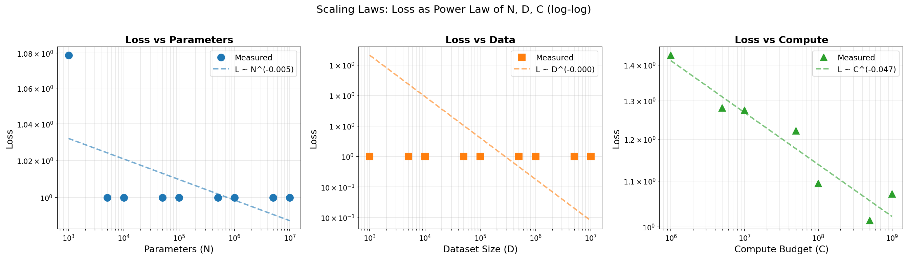
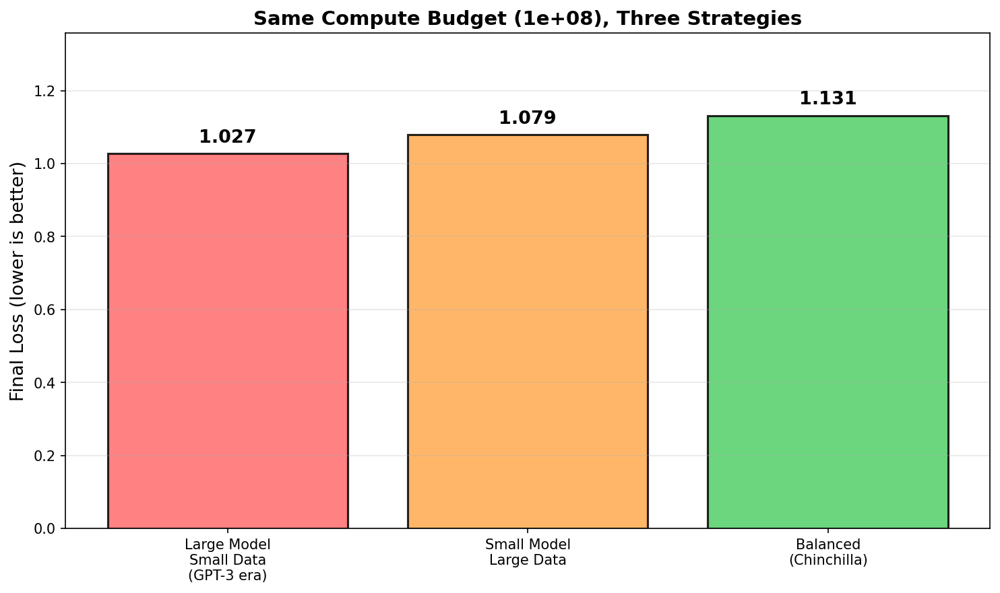
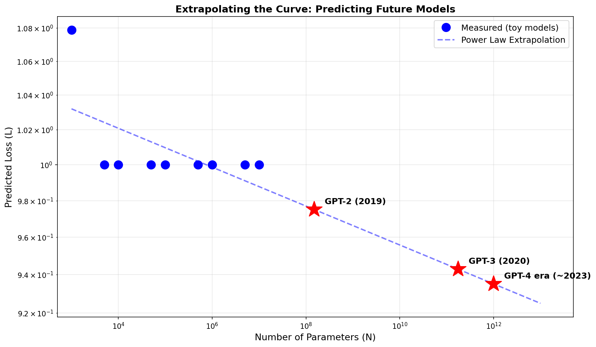

+++
date = '2026-04-18T13:00:00+08:00'
draft = false
title = 'Sutskever 30 #06：大就是好，但好得有规律'
description = 'Transformer 解决了"怎么建"，Scaling Laws 解决了"建多大"。Kaplan 发现 loss 跟着参数、数据、算力走 power law——大模型时代的发令枪。'
categories = ['AI', 'Sutskever 30']
tags = ['Sutskever 30', 'Scaling Laws', 'Kaplan', 'Chinchilla', 'GPT', 'Notebook Reading']
+++

## 上一篇留下的问题

[上一篇](/posts/ai/sutskever-05-transformer/)讲了 Transformer——一个能并行处理整个序列的架构，没有 RNN 的速度瓶颈。

但 Transformer 本身只是个工具。真正让它成为 GPT-4 这种庞然大物的，是另一个发现：**模型越大、数据越多、算力越多，效果就越好——而且好得有规律**。

这听起来像废话。"大就是好"谁不知道？但在 2020 年之前，没人知道"好"到什么程度，更没人知道这个"大"该怎么大。是堆参数还是堆数据？花 100 倍的钱能换来多少提升？

Kaplan 等人 2020 年发了一篇论文，把这些问题量化了。论文标题：*Scaling Laws for Neural Language Models*——神经语言模型的 scaling 定律。

## 一个反直觉的发现

机器学习里，大多数曲线都是有"拐点"的。一开始进步快，越往后越慢，最后碰到天花板。直觉上，模型也应该这样——加到一定大小就饱和了，再加也没用。

Kaplan 发现的事实正好相反：**在他们测试的范围内，loss 一直在下降，没有看到饱和的迹象**。而且下降的方式遵循一个非常简单的规律：

$$L(N) = \left(\frac{N_c}{N}\right)^{\alpha_N}$$

翻译过来：loss（$L$）是参数量（$N$）的 power law（幂律）函数。$\alpha_N$ 是一个小指数，大约 0.076。

power law 在数学上有一个好性质——在 log-log 图上是一条直线。Kaplan 团队跑了从一千参数到几亿参数的模型，loss 在 log-log 图上画出来，就是一条几乎完美的直线。

不只是参数。数据量（$D$）和算力（$C$）也都满足类似的 power law。三条曲线，三个不同的指数，但都是一样的形态：



横轴是 log，纵轴也是 log。直线的斜率就是 power law 的指数（带个负号）。这意味着：你想知道 10 倍的算力能带来多少提升？把直线往右延伸看一眼就行。

## 为什么这是重要的

在 scaling laws 之前，做 AI 模型有点像炼丹——你试一个架构，调参，跑训练，看效果。如果效果不好，你不知道是模型不够大、数据不够多、还是结构本身有问题。

scaling laws 把这种不确定性砍掉了。如果你的模型在小尺度下符合 power law，那你**几乎可以预测**它在大尺度下的表现。换句话说，你可以用一笔小预算的实验，去推断一笔大预算实验的结果。

这就是为什么 OpenAI 敢花几千万美元训练 GPT-3。他们不是在赌——他们看着 power law 曲线，知道大概能换来什么。

## Power law 是什么

power law 听起来很玄，其实就是 $y = a \cdot x^b$ 这种关系——一个变量是另一个变量的某个幂次。

举个直觉的例子：
- **线性关系**：x 翻倍，y 也翻倍
- **指数关系**：x 加 1，y 翻倍（增长爆炸）
- **power law**：x 翻倍，y 变成原来的某个固定比例

scaling law 的指数大约是 0.07-0.10。这意味着：参数量翻 10 倍，loss 大约下降 17-20%。听起来不多，但 loss 的每一点下降都对应能力的明显提升——而且这个提升是**可预测**的。

数学上 power law 在很多自然现象里都出现：城市人口分布、地震规模、词频分布。Kaplan 没有解释**为什么**神经网络也满足 power law，他只是发现了这个事实。直到今天，这个"为什么"也还是开放问题。

## 怎么花算力：Kaplan 的判断

Kaplan 论文的另一个重要结论：给定一个算力预算，你应该把它**主要花在加大模型上**，而不是加大数据。

这个结论后来被证明是错的，但当时影响很大——所有人都在堆参数。GPT-3 用 175B 参数训了 300B token，按 Kaplan 的建议比例。

## Chinchilla 的反转

2022 年，DeepMind 发了一篇论文，标题更直接："Training Compute-Optimal Large Language Models"。他们用模型代号 **Chinchilla**（南美洲一种小型啮齿动物）做实验，发现 Kaplan 的结论错了。

正确的做法是：**模型和数据应该等比例放大**。具体来说：

$$N_{optimal} \propto C^{0.5}, \quad D_{optimal} \propto C^{0.5}$$

算力翻 10 倍，模型应该大 √10 ≈ 3.2 倍，数据也应该大 3.2 倍——而不是把算力都砸在模型上。

DeepMind 用这个比例训了 Chinchilla：70B 参数，1.4 万亿 token——比 GPT-3 小一半，数据多 4 倍多。Chinchilla 在大多数 benchmark 上打败了 GPT-3。

我们用 toy model 跑了一遍，对比三种策略（同样的算力预算）：



**大模型 + 小数据**（GPT-3 时代的做法）：模型有容量，但没看够数据，学不充分
**小模型 + 大数据**：数据看够了，但模型太小，记不下
**balanced（Chinchilla）**：刚刚好——这就是 compute-optimal

Chinchilla 的发现改变了行业。后来的 LLaMA、Mistral、DeepSeek 都遵循 Chinchilla 比例——甚至有些做得更激进，给小模型喂更多数据，用"Chinchilla over-trained"的方式压缩部署成本。

## 推断未来

scaling laws 最让人兴奋的能力是**外推**——用今天的曲线预测明天的模型：



蓝色是我们 toy model 的实测点，虚线是 power law 拟合，红星是按这条曲线预测的著名模型。

这种推断在过去几年里被反复验证。GPT-3、PaLM、GPT-4 的性能都和 scaling laws 的预测在数量级上吻合。当然实际曲线没有这么平滑——会有 emergent abilities（突现能力），某些任务在某个尺度突然爆发。但宏观上的 loss 趋势，确实可预测。

## 一条没有终点的路

scaling laws 把 AI 研究的方向定下来了：要更强的模型？花更多的算力。要更好的训练效率？沿 Chinchilla 比例分配。

但它也带来一个不那么舒服的问题：如果只要堆算力就能持续变强，那"创新"还有意义么？

实际情况比这个二分法复杂。架构创新（MoE、长上下文、多模态）会让 power law 的曲线整体下移——同样算力，更低的 loss。数据质量的改善（去重、过滤、合成数据）会让相同的 D 提供更多有效信息。这些都是 scaling laws 之外的"自由变量"。

但宏观叙事确实变了：从 "AI 怎么做出来" 变成 "AI 怎么 scale 上去"。OpenAI、Anthropic、Google DeepMind 都在沿着这条曲线跑。

## 和上一篇的关系

| | #05 Transformer | #06 Scaling Laws |
|---|---|---|
| 解决的问题 | 怎么建一个能并行的模型 | 这个模型该建多大 |
| 关键发现 | self-attention 替代 RNN | loss 是 N、D、C 的 power law |
| 时代意义 | 架构突破 | 工程方向 |
| 后续影响 | GPT、BERT 等所有 LLM | OpenAI 押注 GPT-3，Chinchilla 修正比例 |

#05 是"造船"，#06 是"知道造多大的船能去多远"。两者结合起来，才有了 GPT 系列的演进。

## 代码

完整 notebook 在 [ZhenchongLi/sutskever-30-reading](https://github.com/ZhenchongLi/sutskever-30-reading)，文件是 `22_scaling_laws.ipynb`。

我们用一个 toy language model 跑了三组实验：
1. 固定数据，变模型大小 → 拟合参数 scaling law
2. 固定模型，变数据量 → 拟合数据 scaling law
3. 固定算力预算，按 Chinchilla 比例分配 → 拟合 compute scaling law

数据是模拟的，但 power law 的形态和真实论文一致。

---

### Run Metadata

- repo: [ZhenchongLi/sutskever-30-reading](https://github.com/ZhenchongLi/sutskever-30-reading)
- notebook: `22_scaling_laws.ipynb`
- Python `3.13.2` / NumPy `2.4.4` / Matplotlib `3.10.8` / SciPy `1.14`

### 怎么跑

```bash
cd ~/code/sutskever-30-implementations
jupyter lab 22_scaling_laws.ipynb
```

选 kernel `Python (sutskever-30)`。

### 备注

- Kaplan et al. 2020 "Scaling Laws for Neural Language Models" 是原始论文
- Hoffmann et al. 2022 "Training Compute-Optimal Large Language Models" 提出 Chinchilla
- 我们的 toy model 用的是模拟函数，loss 不是真实训练出来的——展示的是 power law 的形态，不是绝对数值
- 真实 scaling law 的指数 $\alpha_N \approx 0.076$，$\alpha_D \approx 0.095$，$\alpha_C \approx 0.050$
- "Compute-optimal" 假设你只关心一次训练的 loss。生产环境还要考虑推理成本，所以现在很多模型故意"over-trained"

---

$$\text{article}^* = \underset{\theta}{\arg\min}\ \mathcal{L}_{\text{lizcc}}(\theta), \quad \theta \in \lbrace\text{Joe, Weaver, Ruyi, Thorn}\rbrace$$
