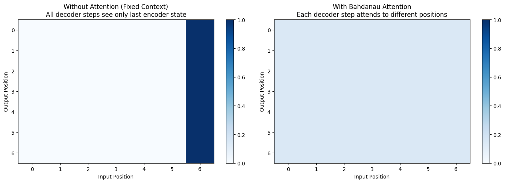

+++
date = '2026-04-23T09:00:00+08:00'
draft = false
title = 'Sutskever 30 #09：不再只靠最后一个向量'
description = '2014 年，Sutskever 和 Bahdanau 都在处理 seq2seq 的长句问题。Sutskever 把输入倒过来读；Bahdanau 把 encoder 的每一步都留下来，让 decoder 每步回头取信息。'
categories = ['AI', 'Sutskever 30']
tags = ['Sutskever 30', 'Attention', 'Bahdanau', 'Seq2seq', 'Notebook Reading']
+++

## 同一年，两组人

2014 年 9 月，两篇论文几乎同时挂上 arXiv。

一篇是 Sutskever、Vinyals、Le 的 [*Sequence to Sequence Learning with Neural Networks*](https://arxiv.org/abs/1409.3215)。Google Brain 出品，用两个 LSTM——一个读输入、一个生成输出——直接刷新了英法翻译的纪录。这是 [#04](/posts/ai/sutskever-04-seq2seq/) 讲过的故事。

另一篇是 Bahdanau、Cho、Bengio 的 [*Neural Machine Translation by Jointly Learning to Align and Translate*](https://arxiv.org/abs/1409.0473)。蒙特利尔大学加雅各布大学，用 GRU + 双向 encoder，每生成一个目标词都回头看一遍源句。

两组人没合作，也没引用对方的当年版本，但他们面对的是同一个问题：任意长度的输入最后都要变成一个固定长度的向量，句子一长，信息就会丢。

两篇论文的处理办法不一样。Sutskever 还在固定向量里想办法，倒着读输入，让最先要翻译的信息离 decoder 更近。Bahdanau 把 encoder 的每一步都留下来，decoder 每一步根据当前状态选择要参考哪些 encoder state。

## 卡在哪里

[#04](/posts/ai/sutskever-04-seq2seq/) 里有一张图：序列越长，第一个词的信息能存活到最后一个 hidden state 的比例越低。50 个词的句子，开头那个词存活率不到 2%。

LSTM 已经缓解了长距离记忆问题。这里卡住的是另一件事：decoder 只拿到 encoder 最后一步的状态。这个状态是一个固定大小的向量，不管输入是 5 个词还是 50 个词，维度都不变。容量有上限，信息没上限。

Sutskever 论文里有一个做法暴露了这件事：把输入序列倒过来读，BLEU 涨好几个点。"Je suis étudiant" 改成 "étudiant suis Je" 喂进去。倒读没有改变模型容量，只是让 encoder 最后一步离 decoder 最先要生成的词更近。这种局部修补能挤出几个点，但也说明结构本身还没换过。

## Bahdanau 的做法（机制细节看 #04）

机制部分 [#04](/posts/ai/sutskever-04-seq2seq/) 已经详细讲过，这里只压三句话：

1. encoder 把每一步的 hidden state 都留下，叫 annotations
2. decoder 每要生成一个词，先用一个小网络给所有 annotations 打分（alignment score），过 softmax 变成权重
3. 权重乘 annotations 求和，得到这一步专用的 context vector，喂给 decoder

整件事可以这样讲：seq2seq 把整句压进一个向量，attention 让 decoder 每一步重新挑该看原句哪里。

要看 alignment 矩阵长什么样、加权求和怎么写代码、对齐为什么能跨语序自动学出来——回 [#04](/posts/ai/sutskever-04-seq2seq/) 看那张法译英对齐图和 NumPy 实现。

## 跑一遍：结构差异

Notebook `14_bahdanau_attention.ipynb` 里有一个最小可执行版本，用一段长度 7 的输入序列 `[1, 2, 3, 4, 5, 6, 7]` 走完整条管线：双向 RNN encoder（hidden size 32）出 7 组 annotations，decoder 7 步，每步对 7 个 annotations 做一次 attention。

权重是随机初始化的，没有训练。这种情况下 attention 分布会接近均匀（每个位置约 1/7 ≈ 0.143），看不出对齐。但还是能用来对比一件事：有 attention 的结构和没有 attention 的结构，两种结构能访问到的信息本来就不一样。



左边模拟没有 attention 的 seq2seq：所有 decoder 步骤都只能看到 encoder 的最后一步——图上只有最后一列有值。右边是 Bahdanau attention：每个 decoder 步骤都能看到所有 encoder 位置——整张图都亮（亮度均匀是因为没训练；训练后会出现对角线那种集中模式）。

这张图要看的不是权重数值，而是 decoder 每一步能访问哪些 encoder state。左图只有最后一个 encoder state 参与计算；右图里，所有 encoder state 都进入了每一步 decoder 的计算。

## 解决了什么

Bahdanau attention 解决了 seq2seq 的几个老问题。

**长句子翻译不再断崖式下降**。原来 30 个词以上的句子 BLEU 暴跌，加了 attention 之后曲线平多了。decoder 不再依赖一个固定向量，而是每步从一组 annotations 里取信息，原则上输入有多长就有多少 annotations。

**对齐和翻译合一**。统计机器翻译时代有专门的对齐模型（IBM Model 1-5、HMM 对齐），用来处理不同语言的语序差异。Bahdanau attention 把对齐当成了翻译过程的副产品——模型自己学"翻译这个英语词时，源句法语里该看哪儿"。一个 alignment 矩阵就能可视化它在做什么。

**倒读输入不再关键**。倒着读输入对 attention 模型几乎没影响，因为 encoder 已经不指望"最后一步保留全部信息"了。Sutskever 那条路上的局部修补在新结构里作用就小了很多。

## 没解决什么

attention 解决了 fixed vector 这个问题，但 RNN 这个底层结构没动。

encoder 还是一步步算 annotations。第 50 个词的 hidden state 必须等前 49 步算完。GPU 的优势在并行计算，RNN 的顺序结构很难把这部分算力用满。

decoder 也还是一步步生成。生成第 t 个词要先有 t-1 步的状态。

attention 最早是在 RNN encoder-decoder 里使用的，但机制本身并不依赖 RNN。它只要一组 key-value 和一个 query 就能算出该看哪里，不在乎 key、value、query 是谁算出来的。

如果 attention 这件事这么管用，为什么不让它做更多？为什么 encoder 内部的词和词之间不也用 attention 互相看一遍？为什么 decoder 不也对自己已经生成的词做一次 attention？如果整个网络都用 attention，RNN 还需要吗？

问题已经摆出来了。

## RNN 时代的最后一步

把 [#02 char-RNN](/posts/ai/sutskever-02-char-rnn/) 到 #09 这条线串起来：

- char-RNN 证明 RNN 能学到字符级别的统计规律
- LSTM 用门控让记忆能跨越长距离
- seq2seq 用两个 LSTM 把"序列到序列"做成一个端到端可训练的架构
- Bahdanau attention 让 decoder 不再只依赖固定向量

到这里，RNN encoder-decoder 在机器翻译里的主要问题都有了对应的解法。再往前走，问题开始落到顺序结构本身。要么继续在 RNN 内部加结构（卷积 RNN、ConvS2S 这种），要么换一套结构。

2017 年，Vaswani 那批人选了第二条路。他们的论文标题正是从 attention 这个机制里找到的：[*Attention Is All You Need*](https://arxiv.org/abs/1706.03762)。把 RNN 整个拿掉，只留 attention，加上位置编码、多头、残差、layer norm。Transformer 由此而来。

但 #10 才讲那一篇。这一篇收尾在这里：attention 仍然长在 RNN 上，但它已经把下一代架构会反复使用的那个操作先写了出来。

## 代码

完整 notebook 在 [ZhenchongLi/sutskever-30-reading](https://github.com/ZhenchongLi/sutskever-30-reading)，文件是 `14_bahdanau_attention.ipynb`。这个 notebook [#04](/posts/ai/sutskever-04-seq2seq/) 里也用过——同一份代码，从两个角度看：#04 是从 seq2seq 视角看 attention 怎么补上固定向量的短板；这一篇是从 attention 视角看它解决了什么、留下了什么。

Notebook 末尾还列了三种常见的 alignment score 写法，一并贴在这里：

```
Bahdanau (additive):       score = v^T tanh(W*s + U*h)
Dot product:               score = s^T h
Scaled dot product:        score = s^T h / sqrt(d_k)
```

Bahdanau 用的是第一种（additive，需要一个小网络）。Luong 2015 提了点积（更便宜）。Transformer 采用的是第三种（scaled dot product），多了一个 $\sqrt{d_k}$ 的缩放，避免高维点积值过大让 softmax 饱和。

---

### Run Metadata

- repo: [ZhenchongLi/sutskever-30-reading](https://github.com/ZhenchongLi/sutskever-30-reading)
- notebook: `14_bahdanau_attention.ipynb`
- 2026-04-23 重新执行通过（`jupyter nbconvert --to notebook --execute --ExecutePreprocessor.timeout=120`），无报错
- 关键输出：input `[1, 2, 3, 4, 5, 6, 7]`，7 个 decoder 步，encoder annotations shape `7 × (32, 1)`，attention 分布因模型未训练而接近均匀（约 0.143）
- Python `3.13.2` / NumPy `2.4.4` / Matplotlib `3.10.8`

### 怎么跑

```bash
cd ~/code/sutskever-30-implementations
jupyter lab 14_bahdanau_attention.ipynb
```

选 kernel `Python (sutskever-30)`。

### 备注

- Bahdanau et al. 2014 *Neural Machine Translation by Jointly Learning to Align and Translate* 是 attention 在 NMT 里的第一篇
- 同年 Sutskever et al. 2014 *Sequence to Sequence Learning with Neural Networks* 提的是 encoder-decoder 框架本身——两篇没合作，但事后看是同一个问题的两条路
- Luong et al. 2015 *Effective Approaches to Attention-based Neural Machine Translation* 把 alignment score 从 Bahdanau 的加性形式（小网络打分）换成乘性形式（点积），更适合 GPU。Transformer 用的是缩放后的点积形式
- Cho 在 Bahdanau 之前写过 GRU 和一篇 RNN encoder-decoder 论文（2014 年 6 月），是 Bahdanau 这篇的直接前作
- 倒读输入在 attention 模型里基本无效，可以用来确认固定向量的限制是否还在

---

$$\text{article}^* = \underset{\theta}{\arg\min}\ \mathcal{L}_{\text{lizcc}}(\theta), \quad \theta \in \lbrace\text{Joe, Weaver, Ruyi, Thorn}\rbrace$$
