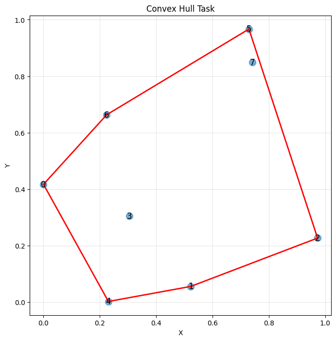
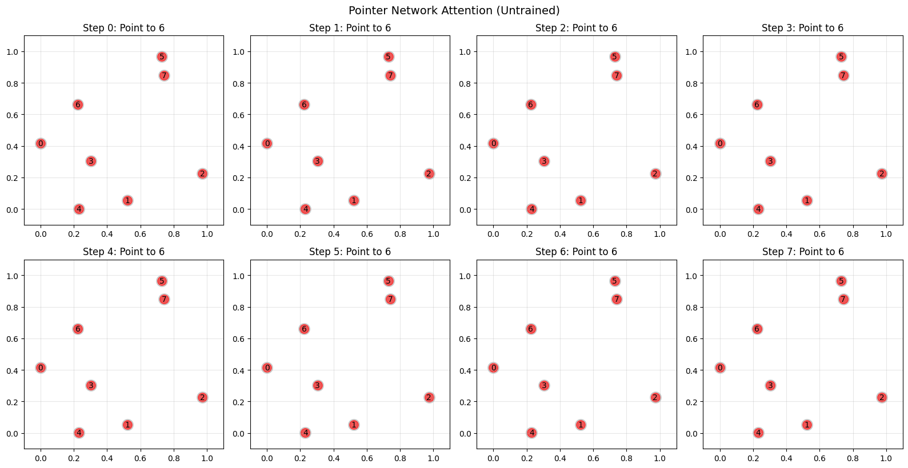
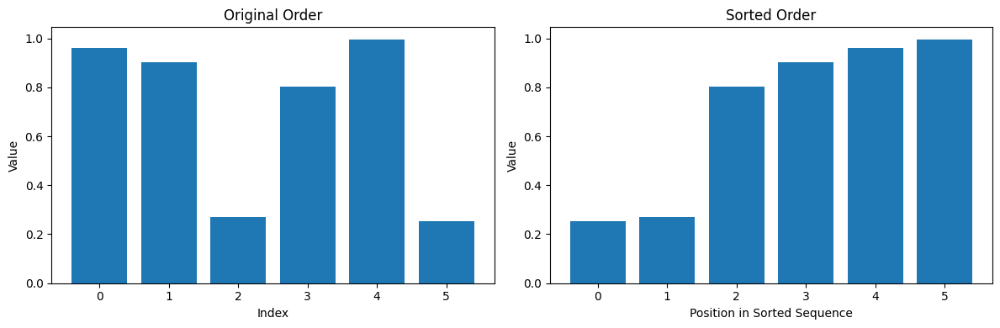

+++
date = '2026-04-24T09:00:00+08:00'
draft = false
title = 'Sutskever 30 #10：答案就在输入里'
description = '2015 年的 Pointer Networks，让 attention 从辅助信号走成了输出本身。原来 softmax 对着固定词表挑词，现在 softmax 对着输入位置挑一个。'
categories = ['AI', 'Sutskever 30']
tags = ['Sutskever 30', 'Pointer Networks', 'Attention', 'Seq2seq', 'Vinyals', 'Notebook Reading']
+++

## 从上一篇留下的问题说起

[#09 Bahdanau attention](/posts/ai/sutskever-09-bahdanau-attention/) 里 attention 是 decoder 的一件工具：每生成一个词，先对 encoder 的所有位置打分，按权重加权求和，得到一个 context 向量喂给 decoder。最终输出还是走 softmax，对着一张固定词表挑一个词。

翻译任务这么做没问题。词表就那几万个词，目标语言里可能出现的词都在表里。

一旦任务变了，问题就出来了。

## 有些任务的答案不在固定词表里

给 7 个二维点，让模型按凸包顺序把其中几个点排出来——输出不是词，是"第 2 号点、第 5 号点、第 6 号点…"这种索引。

所谓凸包顺序，就是沿着最外圈走一圈时，外圈那些点出现的次序。内部的点不参与。



每一步的输出都是"看这 7 个输入点中的哪一个"。固定词表在这里就不够用了。

做法 1：把点的坐标离散化成 tokens，放进词表。坐标是连续的，词表会很大，而且每换一批点就得重训。

做法 2：让词表大小等于输入长度，每次动态调整。7 个点词表就是 7；10 个点词表就是 10。这已经碰到 Pointer Networks 的方向了，但标准 seq2seq 里 decoder 输出层的维度是固定的，换个输入长度还得改网络结构。

真正的问题是这一句：**有些任务的答案不在固定词表里，答案就在输入本身**。

这类任务不少：凸包（输出是输入点的子集，按某种顺序）；排序（输出是输入的重排）；TSP（输出是城市的访问顺序）。共同点是输出的每一步都是在说"回去看输入里的哪一个位置"。

## 机制：让 softmax 指回输入

Pointer Networks 做了一件很朴素的事。

Bahdanau attention 里，每一步算出的 attention 分布只是中间产物——过 softmax 得到权重，再乘 annotations 加权求和，得到 context 向量。分布本身被丢掉了。

Pointer Networks 让 softmax 后的 attention 分布直接当输出分布用：**原来 softmax 对着固定词表挑词；现在 softmax 对着输入位置挑一个**。

$$P(y_t = i \mid y_{<t}, x) = \text{softmax}(u_i^t), \quad u_i^t = v^\top \tanh(W_1 e_i + W_2 d_t)$$

$e_i$ 是第 $i$ 个输入位置的 encoder hidden state，$d_t$ 是 decoder 当前状态。$u_i^t$ 就是 Bahdanau 用的那个加性 alignment score——只是这里不再用它加权求和，而是把 softmax 后的分布直接当作"下一步要指向输入里哪个位置"的概率。

decoder 每一步输出的不是一个词，是一个指针。

整件事可以这样讲：attention 不只可以帮你选输入里的哪一部分，它还可以直接指向答案。

## 跑一遍

Notebook `06_pointer_networks.ipynb` 里有一个最小可执行版本。encoder 用 LSTM 把输入点编码成 hidden states，decoder 每一步对所有 encoder state 算加性分数，softmax 得到一个分布——这个分布就是输出。

拿 7 个点做凸包任务。真实的凸包顺序是 `[2, 5, 6, 0, 4, 1]`（6 个点落在凸包上）。模型没训练，所有预测都指向同一个位置：

```
True convex hull order: [2, 5, 6, 0, 4, 1]
Predicted order:        [6, 6, 6, 6, 6, 6, 6, 6]
```



这一步先确认结构是对的：每一步都输出一个合法分布，总和 1.0000，确实指向输入位置。训练后分布会集中到正确的位置上。

再换个更直观的任务。给 6 个 0 到 1 之间的随机数，让模型输出"升序排列的索引":

```
Values:            [0.96, 0.90, 0.27, 0.80, 1.00, 0.25]
Sorted indices:    [5, 2, 3, 1, 0, 4]
Sorted values:     [0.25, 0.27, 0.80, 0.90, 0.96, 1.00]
```



模型要学的是：第 1 步指向输入里最小的那个（索引 5），第 2 步指向次小的（索引 2）……这些索引合法吗？合法。它们都在 0..5 之间，都在输入长度范围内。这件事不需要模型记住词表，词表就是输入本身。

## 它把什么打开了

Pointer Networks 2015 年挂上 arXiv，作者是 Vinyals、Fortunato、Jaitly。Vinyals 正是前一年跟 Sutskever 合作 [#04 seq2seq](/posts/ai/sutskever-04-seq2seq/) 的一作——这条线可以看作是 seq2seq 的自然延续：seq2seq 把输入编码成状态再解码成序列，Pointer Networks 把"解码"这一步从"对词表采样"换成"对输入位置采样"。

换出来的东西解锁了一类本来在 seq2seq 里做不了的任务：

**词表不够用的时候有救了**。翻译里偶尔遇到一个训练集里没见过的人名、地名，decoder 只能输出 `<UNK>`。后来的 copy mechanism（See et al. 2017 *Get To The Point*）把 Pointer Networks 的思路拼进翻译/摘要里——每一步 decoder 既可以从固定词表里挑词，也可以直接指回输入复制某个 token。

**组合优化问题第一次被神经网络这么碰**。凸包、排序、TSP 这些有严格数学结构的问题，过去是算法课的内容。Pointer Networks 说：这类问题也可以用监督学习端到端学。后来 Bello et al. 2016 *Neural Combinatorial Optimization* 进一步用强化学习训 Pointer Networks 解 TSP，拿到接近动态规划的效果。

**attention 的角色扩大了**。#09 里 attention 是 decoder 的辅助，帮它"回头看输入"。Pointer Networks 让 attention 分布本身就是输出，跳过了 context vector 这一步。attention 不只是中间件，它可以做最终决策。

## Luong 2015 那条线

2015 年 attention 还沿着另一条线往前走。Luong, Pham, Manning 的 *Effective Approaches to Attention-based Neural Machine Translation* 没改 attention 的用途——它还是 decoder 的辅助——改的是打分方式：从 Bahdanau 的加性小网络换成点积。

```
Bahdanau (additive):       score = v^T tanh(W_1 s + W_2 h)
Luong (dot product):       score = s^T h
```

加性形式有一个小 MLP，需要学参数；点积什么参数都不用学，直接算两个向量的内积。点积在 GPU 上跑得快，矩阵乘一步到位。

乘性路径后来走到 Transformer 的 scaled dot product attention：

$$\text{score} = \frac{s^\top h}{\sqrt{d_k}}$$

多了一个 $\sqrt{d_k}$ 的缩放，避免高维点积值过大让 softmax 饱和。这就是 #05 里讲过的 attention 形式。

这一篇不展开 Luong，只点一下：2015 年之后 attention 沿两条线继续长，Pointer Networks 走"attention 能当输出吗"，Luong 走"attention 怎么更便宜"。前一条进入了 copy、pointer-generator、组合优化；后一条直接通向了 Transformer。

## 代码

完整 notebook 在 [ZhenchongLi/sutskever-30-reading](https://github.com/ZhenchongLi/sutskever-30-reading)，文件是 `06_pointer_networks.ipynb`。

toy 实验示范了：

1. 定义 attention-based pointing 模块——对每个输入位置算加性分数，softmax 得到概率分布
2. 构建 Pointer Network（LSTM encoder + LSTM decoder + pointing attention）
3. 生成凸包训练数据（10 组随机点）
4. 未训练的网络做一次前向，验证输出分布合法、形状正确
5. 构建排序任务，展示 pointer 机制在非几何任务上同样适用

没跑完整训练，重点在"机制跑通"——pointer 分布形状对、总和为 1、每一步都能产生合法索引。

---

### Run Metadata

- repo: [ZhenchongLi/sutskever-30-reading](https://github.com/ZhenchongLi/sutskever-30-reading)
- notebook: `06_pointer_networks.ipynb`
- 2026-04-24 重新执行通过（`jupyter nbconvert --to notebook --execute --ExecutePreprocessor.timeout=300`），无报错
- 关键输出：独立 pointing demo 单元的 attention 分布 shape `(5, 1)`、总和 1.0000（这个 cell 用的是长度为 5 的合成输入，跟下面的 7 点凸包和 6 值排序是不同的运行）；凸包任务 7 点真实顺序 `[2,5,6,0,4,1]`；排序任务 6 值的正确索引顺序 `[5,2,3,1,0,4]`
- Python `3.13.2` / NumPy `2.4.4` / Matplotlib `3.10.8`

### 怎么跑

```bash
cd ~/code/sutskever-30-implementations
jupyter lab 06_pointer_networks.ipynb
```

选 kernel `Python (sutskever-30)`。

### 备注

- Vinyals et al. 2015 *Pointer Networks* 是这篇的原始论文，NeurIPS 2015。作者顺序 Vinyals / Fortunato / Jaitly——Sutskever 不在作者里，但 Vinyals 正是前一年跟 Sutskever 合作 seq2seq 的一作，所以这条线算是从 seq2seq 长出来的
- See et al. 2017 *Get To The Point: Summarization with Pointer-Generator Networks* 把 pointer 机制和普通 seq2seq 融合——decoder 每步先决定"从词表里挑还是从输入里复制"，再走对应的分支
- Bello et al. 2016 *Neural Combinatorial Optimization with Reinforcement Learning* 用 RL 训 Pointer Networks 解 TSP，比监督学习更适合没有 ground truth 路径的情况
- Luong et al. 2015 *Effective Approaches to Attention-based Neural Machine Translation* 是乘性 attention 的原始论文，这条线后来被 Transformer 继承

---

$$\text{article}^* = \underset{\theta}{\arg\min}\ \mathcal{L}_{\text{lizcc}}(\theta), \quad \theta \in \lbrace\text{Joe, Weaver, Ruyi, Thorn}\rbrace$$
