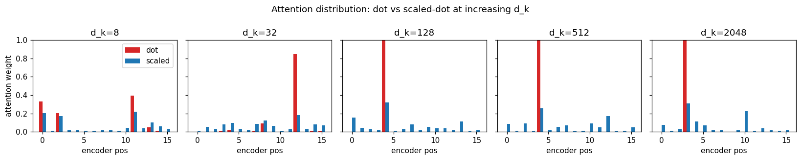

+++
date = '2026-04-25T09:00:00+08:00'
draft = false
title = 'Sutskever 30 #11：让 attention 算得快一点'
description = 'Bahdanau 让 attention 进了翻译系统，Luong 2015 改的是算分方式：从加性小网络换成点积。一次矩阵乘就能把 score 算完；维度升高之后，softmax 饱和的问题也一起出现了。'
categories = ['AI', 'Sutskever 30']
tags = ['Sutskever 30', 'Attention', 'Luong', 'Dot Product', 'Scaled Dot Product', 'Notebook Reading']
+++

## 从 #10 留下的尾巴说起

[#10 Pointer Networks](/posts/ai/sutskever-10-pointer-networks/) 结尾留了一句：2015 年 attention 沿两条线继续长——一条是 Pointer Networks，让 attention 直接当输出；另一条是 Luong，让 attention 算得更便宜。

这一篇走第二条。

Bahdanau 2014 把 attention 接进了 NMT，效果好。但 attention 这一步本身是有成本的。每生成一个目标词，decoder 都要对 encoder 的所有位置打一遍分。源句 50 个词，decoder 生成 50 个词，光是算 score 就要 2500 次。

每一次 score 怎么算，决定了这件事到底贵不贵。

## Bahdanau 的算分方式

Bahdanau 用的是加性形式：

$$e_{ij} = v^\top \tanh(W s_{i-1} + U h_j)$$

`s` 是 decoder 的上一步状态，`h` 是 encoder 第 j 个位置的 annotation。

这里面有三组参数：`W`（把 `s` 投到打分空间）、`U`（把 `h` 投到打分空间）、`v`（把打分空间压成一个标量）。算一次 score 要做两次矩阵乘、一个 tanh、一个内积。

这是个小 MLP。表达力不错，但每个 (i, j) 对都要走一遍。

## Luong 的改法

Luong, Pham, Manning 2015 *Effective Approaches to Attention-based Neural Machine Translation* 把这一整套换成一行：

$$e_{ij} = s_i^\top h_j$$

`s` 和 `h` 直接做内积。没有 `W`、`U`、`v`，没有 tanh，没有要训练的 score 参数。

改动不大，计算形态变了。decoder 当前状态 `s` 是一个 `d_k` 维向量，encoder annotations 摞起来是一个 `T × d_k` 矩阵，所有 score 可以一次矩阵乘算完。Bahdanau 那个 MLP 的话，得 for 每个位置走一遍前向。

## 乘性路径为什么成立

跳过加性里的小网络，模型不会少表达点东西吗？

Luong 的判断是，score 这一步不需要太厚的表达力。

`s` 和 `h` 已经是 RNN 算出来的状态向量。RNN 内部有大量参数在学"怎么把信息编码进这个向量"。score 这一步要做的事情很窄：在已经编码好的 `s` 和一组 `h` 之间，给出"哪些 `h` 跟当前 `s` 最相关"的打分。

如果 `s` 和 `h` 已经把信息编码进去了，内积足够给出一个相关性排序。`s` 和 `h` 朝同一个方向，内积大；朝相反方向，内积负；正交，接近零。score 要的就是"高分代表相关"。

Bahdanau 加性形式相当于在算分这一步又多塞了一层非线性。它确实更有表达力，但表达力的红利能不能盖过额外参数的成本和算力开销，并不显然。Luong 的赌注是：不能。score 应该薄一点，让真正的表达力放在 RNN 里。

后来 Transformer 沿着这条乘性路径继续往前走。

## 跑一遍

notebook `luong_attention_demo_20260425.ipynb` 里把三种 score 函数放在同一组输入上跑了一遍。decoder 状态 `s` 是 32 维，encoder 7 个 annotation `h_1..h_7`，分别用 Bahdanau 加性、点积、缩放点积算 score，再 softmax 出权重：

```
Bahdanau weights:    [0.154 0.106 0.158 0.155 0.104 0.166 0.157]
Dot product weights: [0.000 0.564 0.001 0.422 0.013 0.000 0.000]
Scaled dot weights:  [0.060 0.297 0.099 0.282 0.152 0.067 0.044]
```

三个分布都合法（和为 1），但形状差很多。Bahdanau 的分布很平，因为参数刚初始化、没训练；点积的分布已经很尖了，几乎全压在两个位置上——这不是效果更好，只是数值尺度更大。缩放点积介于两者之间。

后两个的差别后面会讲。先看速度。

同样的输入，重复 10000 次：

```
Bahdanau additive: 184.1 ms total, 18.41 us/call
Dot product:        6.1 ms total,  0.61 us/call
Speedup: 30.1x
```

这里还只是 CPU 上的 NumPy 单线程；真正放到 GPU 的矩阵乘场景，点积形式更容易批处理。

## 但点积有个代价

回到上面那个观察：点积权重几乎全压在两个位置上。这不是好事。

直觉是：`s` 和 `h` 都是 32 维向量，元素方差为 1，那么 `s . h` 的方差大约就是 32（独立项相加）。维度越高，score 的数值越大；softmax 是指数函数，输入数值大就会饱和——分布变成接近 one-hot，梯度变成接近 0。

写成实验更直接。固定 16 个 encoder 位置，让 `d_k` 从 8 涨到 2048，看 attention 分布的熵（uniform 分布的熵是 `log(16) ≈ 2.77`，分布越尖熵越低）：

```
   d_k |   H(dot) | H(scaled) | H(uniform)
--------------------------------------------
     8 |   1.3699 |    2.3960 |    2.7726
    32 |   0.5938 |    2.3483 |    2.7726
   128 |   0.2937 |    2.3380 |    2.7726
   512 |   0.0752 |    2.3692 |    2.7726
  2048 |   0.0590 |    2.3638 |    2.7726
```

`d_k=512` 那行：纯点积分布的熵已经掉到 0.08，几乎是 one-hot 了。但缩放点积稳定在 2.37 附近，接近 uniform。



图里每一格是一个 `d_k` 下的 16 个 encoder 位置。红条是纯点积，蓝条是缩放点积。`d_k=8` 时两者都是合理分布；到 `d_k=512`、`d_k=2048` 红条已经一根独高，蓝条还分散在所有位置上。

## 缩放点积

缩放就是修这个问题。

$$e_{ij} = \frac{s_i^\top h_j}{\sqrt{d_k}}$$

除以 `sqrt(d_k)` 之后，score 的方差从 `d_k` 变回 1，softmax 重新落在好用的区间里。这个公式不是 Luong 那篇里的（他写的是纯点积），是后来 Transformer 论文给的修补。但读者一般是连着学的，知道缩放点积是哪儿来的，比单独学 Luong 更顺。

Luong 的论文里其实给了三种 score 函数：dot、general（中间加一个 W）、concat（其实就是 Bahdanau 的形式）。Luong 试下来 dot 在某些任务上最好。Luong 那篇没有引入缩放；缩放是 Vaswani 2017 后来补上的。Transformer 把 hidden 维度切成多个 head，每个 head 的 `d_k` 是 64，恰好踩在饱和的边缘——这个尺度上加上缩放就稳了。

## 这条路通向哪里

Luong 这一步表面上只是把小网络换成内积，影响却很长。放进 attention 的发展路线里看，它把加性算分这条路拐到了乘性算分上。

加性路径：表达力强，但每个 score 都要走一个 MLP，难批处理。

乘性路径：表达力薄一层，但所有 score 一次矩阵乘搞定，GPU 友好，可以横向堆叠（多头）、纵向堆叠（多层）。

后来 *Attention Is All You Need*（[#05](/posts/ai/sutskever-05-transformer/) 讲过那一篇）选乘性路径，把 RNN 整个拿掉。如果 score 还是加性的，每一步都要走小 MLP，Transformer 那种 `O(n²)` 的 self-attention 代价会高很多。

Luong 留下的是：score 是可以薄的。表达力放在别的地方。

## 代码

完整 notebook 在 [ZhenchongLi/sutskever-30-reading](https://github.com/ZhenchongLi/sutskever-30-reading)，文件是 `luong_attention_demo_20260425.ipynb`。

跑了三件事：

1. 三种 score 函数（Bahdanau additive、dot、scaled dot）在同一组输入上各算一遍权重，确认都是合法分布
2. 加性 vs 点积的 wall-clock 对比，10000 次 NumPy 调用看到 30 倍速差
3. 在 `d_k ∈ {8, 32, 128, 512, 2048}` 上分别跑 200 次，比较纯点积和缩放点积的分布熵——看高维度下 softmax 怎么饱和、缩放怎么把它修回去

---

### Run Metadata

- repo: [ZhenchongLi/sutskever-30-reading](https://github.com/ZhenchongLi/sutskever-30-reading)
- notebook: `luong_attention_demo_20260425.ipynb`
- 2026-04-25 重新执行通过（`jupyter nbconvert --to notebook --execute --ExecutePreprocessor.timeout=120`），无报错
- 关键输出：`d_k=32`、`T=7` 时三种权重分布形状对照；10000 次调用 Bahdanau 184.1 ms、点积 6.1 ms（30.1x speedup，CPU NumPy 单线程）；`d_k=2048` 时纯点积分布熵 0.06、缩放点积 2.36、均匀基线 `log(16)=2.77`
- Python `3.13.2` / NumPy `2.4.4` / Matplotlib `3.10.8`

### 怎么跑

```bash
cd ~/code/sutskever-30-implementations
jupyter lab luong_attention_demo_20260425.ipynb
```

选 kernel `Python (sutskever-30)`。

### 备注

- Luong, Pham, Manning 2015 *Effective Approaches to Attention-based Neural Machine Translation* 是这一篇的原始论文。它实际给了三种 score（dot / general / concat），文里说 dot 在 global attention 下表现最好
- 缩放因子 `1/sqrt(d_k)` 不是 Luong 引入的，是 Vaswani et al. 2017 *Attention Is All You Need* 加的修补。这一篇把它一起讲是因为读者实际接触到的就是缩放点积
- Bahdanau 用 `s_{i-1}` 算 score，Luong 用 `s_i`——位置差一步，论文里讨论过，但跟"加性 vs 乘性"这个主线无关，没展开
- `general` 形式 `s^T W h` 是个折衷：保留 score 上一个可训练的 `W`，但仍然只是一次矩阵乘。后来在 Transformer 的 query/key/value 投影里能看到这个形式的影子

---

$$\text{article}^* = \underset{\theta}{\arg\min}\ \mathcal{L}_{\text{lizcc}}(\theta), \quad \theta \in \lbrace\text{Joe, Weaver, Ruyi, Thorn}\rbrace$$
