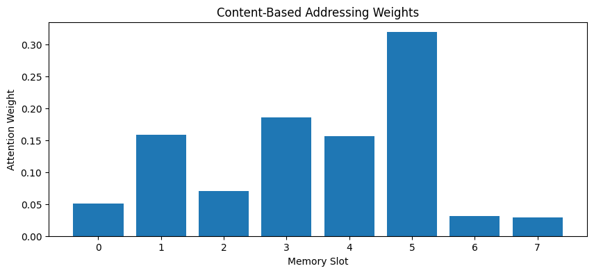
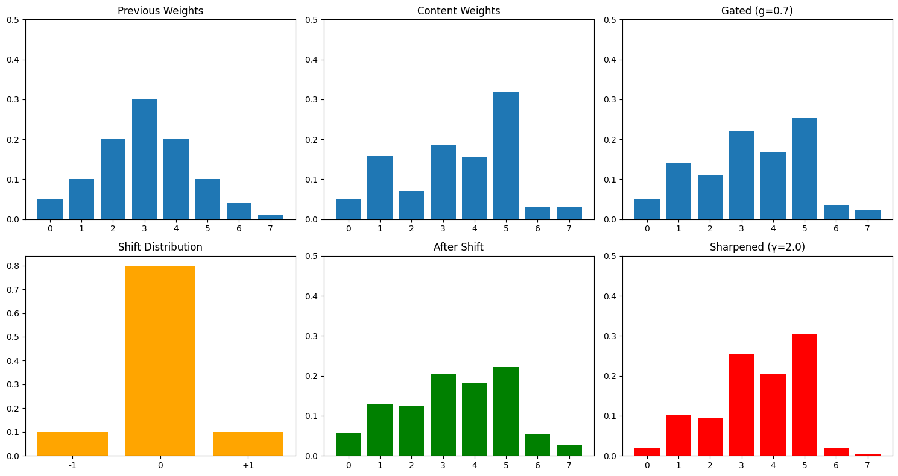
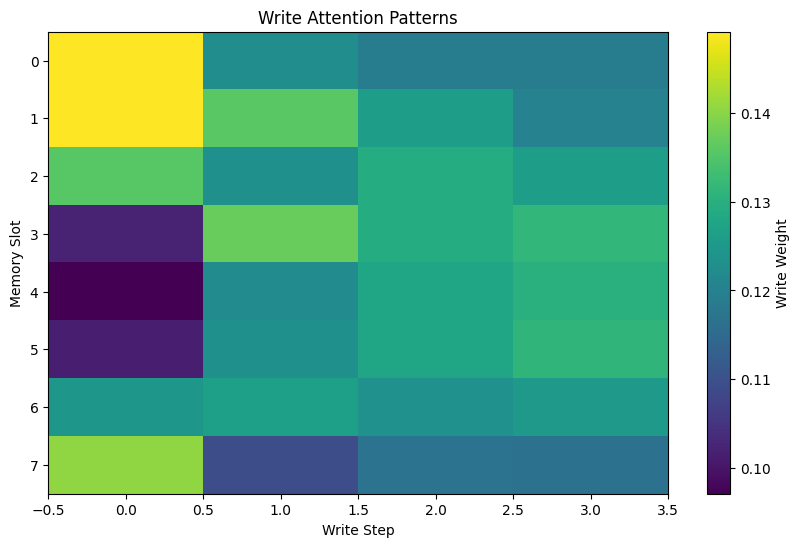
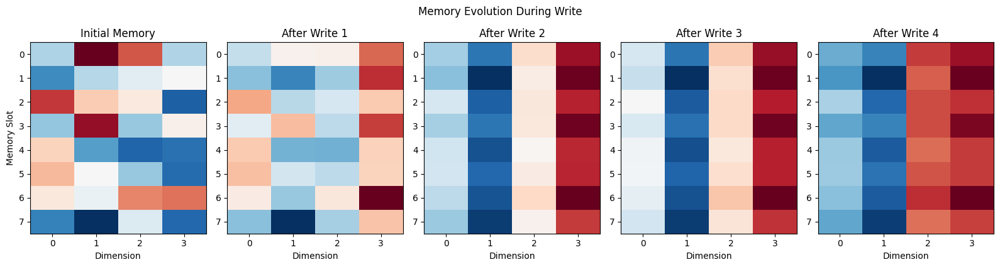

+++
date = '2026-04-27T09:00:00+08:00'
draft = false
title = 'Sutskever 30 #12：让 attention 能写'
description = 'Pointer Networks 让 attention 指向输入位置。Graves et al. 2014 的 Neural Turing Machine 再往前走一步：attention 不只可以读，还可以控制一块可读可写的记忆。'
categories = ['AI', 'Sutskever 30']
tags = ['Sutskever 30', 'NTM', 'Neural Turing Machine', 'External Memory', 'Attention', 'Notebook Reading']
+++

## 从 #10 留下的问题接过来

[#10 Pointer Networks](/posts/ai/sutskever-10-pointer-networks/) 让 attention 第一次直接当输出——softmax 不再对着固定词表挑词，而是对着输入位置挑一个。decoder 每一步指向输入里的某个地方。

不过那还是 read-only 的指针。模型只能指过去读，不能在那个位置上留下新内容。

Graves、Wayne、Danihelka 2014 *Neural Turing Machines* 把指针往前推了一步：attention 不只能读，还能写。模型旁边放一块外部 memory，就是一张可读可写的矩阵。每一步 controller 算出两类指针：一组用来读，一组用来擦+加。

这就是 NTM 的主问题：**如果 attention 已经能指向输入里的位置，下一步自然就是：它能不能指向一块可读可写的记忆？**

## 一块 N×M 的矩阵

把 memory 想成一个矩阵 `M`，`N` 行（slot 数），每行 `M` 维（slot 大小）。这就是 NTM 的"外部 memory"。

读操作很直接。给一个 attention 权重 `w`（一个长度为 `N` 的概率分布），读出来的就是按 `w` 对所有行的加权求和：

$$r_t = \sum_i w_t(i) \cdot M_t(i)$$

跟 Bahdanau attention 算 context vector 是一样的——只是这里的"key/value"不是 encoder 的 annotations，而是 memory 矩阵本身。

写操作多一步：先按 `w` 擦掉旧内容，再按 `w` 加上新内容。controller 输出两个 `M` 维向量：一个 erase vector `e`，一个 add vector `a`：

$$M_t(i) = M_{t-1}(i) \cdot (1 - w_t(i) \cdot e) + w_t(i) \cdot a$$

`w` 越偏向某一行，那一行被擦改得越多。`w` 越平均，所有行都受一点影响。**写的力度由 attention 控制**。

## 怎么定位到要读/写的地方

NTM 的寻址过程比 Bahdanau 多几步。Bahdanau 一步算完 score，softmax 出权重就完了。NTM 走一条流水线：

第一步是**内容寻址**（content addressing）。controller 输出一个 key 向量，跟 memory 每一行算余弦相似度，再过 softmax：

$$w^c_t(i) = \frac{\exp(\beta_t \cdot \cos(k_t, M_t(i)))}{\sum_j \exp(\beta_t \cdot \cos(k_t, M_t(j)))}$$

`β` 是温度——越大权重越尖。这一步在做的事：根据"我要找的内容长什么样"找到 memory 里最像的那行。



8 个 slot，按 cosine similarity 出来的权重大致这样：`[0.05, 0.16, 0.07, 0.19, 0.16, 0.32, 0.03, 0.03]`，和为 1.0000。第 6 个 slot 内容跟 key 最像，得分最高。

光有内容寻址还不够。如果 controller 想要按顺序遍历 memory（比如把序列一行一行写进去），它需要"上一步的位置往后挪一格"这种能力。这一步叫**位置寻址**（location addressing）。

位置寻址再分三段：

1. **interpolation**：一个门 `g ∈ [0, 1]`，决定这一步用新算的内容权重还是上一步的权重。`g=1` 完全用内容；`g=0` 完全沿用上一步。
2. **convolutional shift**：一个 shift 分布（比如 -1/0/+1 三个位置上的概率），把当前权重做一次环形卷积，等于把 attention 整体平移。
3. **sharpening**：一个 `γ ≥ 1`，把权重过 `w^γ` 再归一化，让分布更尖锐。



六个面板从左到右上到下：上一步权重 → 内容权重 → 门控融合 → shift 分布 → 平移后 → 锐化后。每一步都是可微的，整套寻址都能反向传播。

## 跑一遍：拷贝任务

NTM 论文里的经典任务是 copy：给一段长度为 `T` 的随机向量序列，让网络复述一遍。这事儿用 LSTM 也能干，但 LSTM 的 hidden state 容量有限，长序列会丢；NTM 把序列写到外部 memory，再读出来，理论上长度无关。

notebook 里复现了一个最小版本。8 个 slot、每个 slot 4 维，写入 4 个 one-hot 向量：



最左边是初始随机的小值 memory；右边四张图是依次写入 4 个向量后 memory 的变化。每一步只有少数行（attention 集中的位置）被改动了。

写操作每一步用的 attention 分布长这样：



横轴是 4 个写入步，纵轴是 8 个 slot。每一列是一步的 attention 分布。颜色越亮表示这一步更倾向于在那个 slot 上写。

这里 controller 还是随机参数，没经过训练，所以写注意力没有形成稳定模式，不像论文里训练好之后那种"对角线"——一个 slot 写一个 step。这一步只是确认机制跑通：每一步 attention 分布合法（和为 1）、写操作能修改 memory、erase+add 公式数值上没炸。

## 为什么这条路没成主流

问题主要出在训练稳定性。

attention 的可微性是有的，但实际训练 NTM 非常 brittle。论文里需要小心调超参数（slot 数、shift 范围、controller 类型）；稍微改一下任务，原来好的设置就不工作了。后来 Graves 团队 2016 出了 Differentiable Neural Computer (DNC) 修了一些稳定性问题，但模型变得更复杂，调参更难。

另一个问题是 memory 大小。NTM 的 memory 是固定的 `N×M`，写得越多越容易冲掉旧内容。要做大规模任务（比如几千 token 的上下文），N 必须很大，attention 寻址的成本就上来了。

后来 attention 的发展走了另一条路。Transformer 不显式区分 read/write 两个操作，也不维护一块"外部 memory"。它把 attention 同时用在 encoder（每个位置看所有位置）和 decoder（看 encoder + 看自己已经生成的部分）上。要保留信息的时候，新的隐藏状态加进序列后续还能被 query 到。"读"和"写"在这套系统里是同一种操作的两面。

这其实把 NTM 简化了：去掉了显式的 erase + add，去掉了 location addressing，只留下 content addressing（点积+softmax）。能简化是因为 Transformer 不强求 memory slot 数是固定的——序列长多少，可被 query 的隐藏状态就有多少。

## NTM 留下的东西

不显式 read+write 的 attention 后来主导了。但 NTM 的几条思路没死：

- **可微 memory** 的概念被 Memory Networks（Sukhbaatar et al. 2015）继承，再往后渗进 retrieval-augmented generation 这条线。RAG 系统每次"读外部知识"，本质就是用 query 在一个外部 memory（向量库）里做 content addressing。
- **erase + add 这种结构化写**让 LSTM 那种"门控更新隐藏状态"的思路在外部存储上有了类似实现。门控 + 加性更新现在仍在很多 stateful 模块里。
- **content + location 的混合寻址**虽然不再原样使用，但提醒了一件事：纯 content-based attention 在某些任务上不够，序列里的位置信息要么显式编码（Transformer 的 positional encoding），要么靠 RNN 的隐含顺序。NTM 是第一个把这个问题摆出来的。

NTM 在 2014 年问的问题，attention 后来用另一种形式回答了。问题问对了，后来的系统用了别的办法回答它。

## 代码

完整 notebook 在 [ZhenchongLi/sutskever-30-reading](https://github.com/ZhenchongLi/sutskever-30-reading)，文件是 `20_neural_turing_machine.ipynb`。

跑了五件事：

1. 定义外部 memory 矩阵（`N=8`, `M=4`），实现 read 和 write（erase + add）
2. 内容寻址：cosine similarity + 带温度的 softmax
3. 位置寻址流水线：interpolation gate / convolutional shift / sharpening
4. 完整 NTM head 把所有 controller 输出（key、β、g、shift weights、γ、erase、add）拼起来
5. 拷贝任务最小版：4 个 one-hot 向量写进 8 槽 memory，可视化 memory 演化和写注意力模式

---

### Run Metadata

- repo: [ZhenchongLi/sutskever-30-reading](https://github.com/ZhenchongLi/sutskever-30-reading)
- notebook: `20_neural_turing_machine.ipynb`
- 2026-04-27 重新执行通过（`jupyter nbconvert --to notebook --execute --ExecutePreprocessor.timeout=120`），无报错
- 关键输出：8×4 memory，content addressing 权重 `[0.05, 0.16, 0.07, 0.19, 0.16, 0.32, 0.03, 0.03]` 和为 1.0000；位置寻址流水线六阶段可视化；4 步写入后 memory 矩阵演化 + 写注意力模式（controller 随机，未训练）
- Python `3.13.2` / NumPy `2.4.4` / Matplotlib `3.10.8`

### 怎么跑

```bash
cd ~/code/sutskever-30-implementations
jupyter lab 20_neural_turing_machine.ipynb
```

选 kernel `Python (sutskever-30)`。

### 备注

- Graves, Wayne, Danihelka 2014 *Neural Turing Machines* 是这一篇的原始论文（arXiv 1410.5401）。同年 Graves 还写了 *Generating Sequences With Recurrent Neural Networks*，里面的 attention-driven generation 是 NTM 的前身
- Graves et al. 2016 *Hybrid computing using a neural network with dynamic external memory* (Nature) 是 NTM 的下一代——Differentiable Neural Computer。引入了 free list + temporal link matrix，让 memory 分配更稳，但模型变得更复杂
- Sukhbaatar et al. 2015 *End-to-End Memory Networks* 是相关线但更轻量：不写，只读，多层 hop 形成"推理"。这条线后来跟 Transformer 走得更近
- Pointer Networks（[#10](/posts/ai/sutskever-10-pointer-networks/)）和 NTM 都是 2014–2015 attention 扩展的产物，但目标不同：Pointer Networks 是 attention 当输出（指向输入位置）；NTM 是 attention 控制读写一块独立的 memory
- 后来的大模型系统把"把信息保留下来，下一步还能再取用"这件事做成了别的结构

---

$$\text{article}^* = \underset{\theta}{\arg\min}\ \mathcal{L}_{\text{lizcc}}(\theta), \quad \theta \in \lbrace\text{Joe, Weaver, Ruyi, Thorn}\rbrace$$
