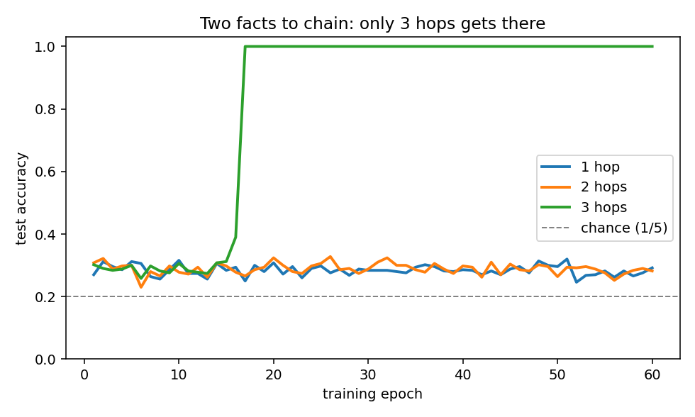
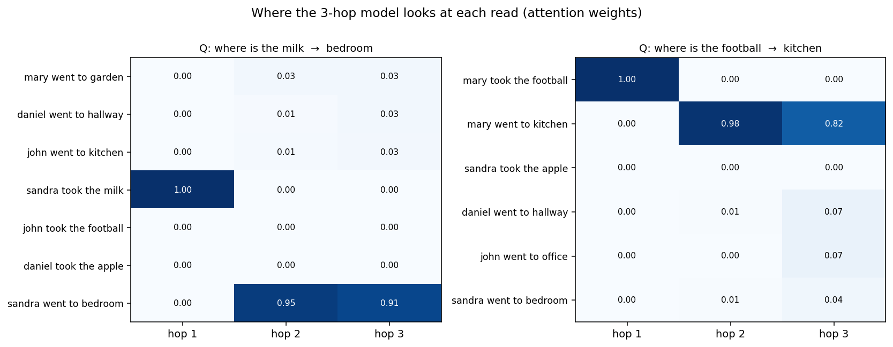

+++
date = '2026-06-04T09:00:00+08:00'
draft = false
title = 'Sutskever 30 #13：只读，但读好几遍'
description = '#12 的 NTM 让 attention 能读能写，但 location addressing 加 erase/add 那套机器很难训。Sukhbaatar et al. 2015 的 End-to-End Memory Networks 把写和位置寻址全砍掉，只留 content-based 的读——代价是把同一块记忆读好几遍，让模型自己学会顺着事实链往下跳。'
categories = ['AI', 'Sutskever 30']
tags = ['Sutskever 30', 'Memory Networks', 'MemN2N', 'Attention', 'Multi-hop', 'End-to-End', 'Notebook Reading']
+++

## 从 #12 的"写"接过来

[#12 Neural Turing Machine](/posts/ai/sutskever-12-neural-turing-machine/) 让 attention 既能读也能写一块外部 memory。代价是那套寻址机器很重：内容寻址之外还要 interpolation、convolutional shift、sharpening 一条流水线，写的时候又要 erase 再 add。东西能跑，但训练很 brittle，换个任务就得重调。

Sukhbaatar、Szlam、Weston、Fergus 2015 *End-To-End Memory Networks*（这一篇下面简称 MemN2N）问了个反方向的问题：**这些机器是不是大部分都可以不要？**

它的答案是：把写砍掉，把 location addressing 砍掉，只留 NTM 里最朴素的那一半——content-based 的读。memory 不再是一块要反复擦改的矩阵，就是输入本身，写一次，之后只读。

只读会不会太弱？MemN2N 的补法是：**读好几遍**。一遍不够就拿这一遍的结果当新问题再读一遍。下面把这事拆开看。

## 记忆就是输入本身

NTM 要专门维护一块 `N×M` 的矩阵，每步擦改。MemN2N 干脆不写：一段话里的每个事实，就是 memory 里的一行。

把每个事实 `x_i`（一句话的 bag-of-words）用一个嵌入矩阵投成向量 `m_i = A x_i`，问题 `q` 投成 `u = B q`。读一遍就是一次 content addressing——跟 [#11 Luong](/posts/ai/sutskever-11-luong-attention/) 的点积、[#12](/posts/ai/sutskever-12-neural-turing-machine/) 的内容寻址是同一个动作：

$$p_i = \mathrm{softmax}(u^\top m_i), \qquad o = \sum_i p_i\, c_i$$

`p` 是 attention 权重，`o` 是读出来的内容。注意读出用的是另一套嵌入 `c_i = C x_i`——一套嵌入管"拿什么去匹配"，一套管"匹配上了读回什么"。后来 Transformer 里 key 和 value 分开，是同一个分工。

没有 erase，没有 add，没有 shift。NTM 的读那一半，原样留下；其余全删。

## 读一遍不够：多跳

光读一遍能干嘛，看任务就知道。

demo 里的任务是合成的两跳问答。一段话随机打乱地摆几条事实，每个人去了某个地点，某个物体被某个人拿走，然后问：**物体现在在哪？**

```
mary went to garden
daniel went to hallway
john went to kitchen
sandra took the milk
john took the football
daniel took the apple
sandra went to bedroom
Q: where is the milk?  ->  bedroom
```

要答对，得顺着事实链走两步：milk → 谁拿了它（sandra）→ sandra 去了哪（bedroom）。

读一遍卡在哪？问题"where is the milk"跟 memory 做 content addressing，能匹配上的是 "sandra took the milk"（共享 milk 这个词）。可这条事实只告诉你拿东西的人是 sandra，没有地点。一次查询到此为止。

所以再读一遍。把第一遍读出来的 `o` 加回问题向量，当新的 query 再查一次：

$$u^{k+1} = u^k + o^k$$

第二遍的 `u` 里带上了"sandra"这条信息，这回能匹配上 "sandra went to bedroom"。读 `K` 遍之后，用最后的 `u` 预测答案：

$$\hat a = \mathrm{softmax}(W u^{K+1})$$

这就是 multi-hop：同一块 memory 读 `K` 遍，每遍拿上一遍的结果细化 query。

## 跑一遍

notebook 里用纯 NumPy 写了这个最小 MemN2N（嵌入矩阵 `A`/`B`/`C`、读出 `W`，层间权重共享，Adam 训练），在 2000 条合成故事上训，500 条测，比较读 1、2、3 遍的效果：



5 个地点，瞎猜是 0.20，按训练集最常见答案猜是 0.188。结果：

- **1 hop：0.292**——基本就在瞎猜附近。一次 content addressing 跨不过 milk → sandra → bedroom 这条两步链。
- **2 hops：0.282**——按道理两遍够了（一遍找人，一遍找地点），但训练稳定地卡在一个很差的局部极小，跟 1 hop 没区别。
- **3 hops：1.000**——干净解决。论文里 bAbI 用的也正是 K=3。

2 hop 卡住这件事不是 bug，是 MemN2N 论文明说的毛病：softmax 让训练容易掉进差的局部极小。论文的补丁叫 linear start——前几个 epoch 先把 memory 层的 softmax 拿掉、退化成线性，再装回去。这个最小版没上这类技巧，所以 2 hop 翻车翻得比论文里更彻底。**能跑通，但很挑训练**——跟 #12 NTM 是一个味道。

## 注意力自己学会了路由

3 hop 模型解决了任务。更值得看的是它**怎么**解决的——每一遍 attention 落在哪：



横轴是三遍读，纵轴是故事里的事实，格子是 attention 权重。两个例子都是同一个模式：

- **hop 1 落在 "took" 那条事实上**（谁拿了被问的物体）。
- **hop 2、hop 3 落在那个人的 "went" 事实上**（这人去了哪）。

不是挑出来的好例子。500 条测试故事上统计：hop 1 命中 "took" 事实的比例是 **1.00**，hop 2/3 命中 "went" 事实是 **1.00**。模型每次都走 物体 → 持有者 → 地点 这条两步链。

关键在于：**没有人告诉它该看哪些事实**。训练时只给了问题和答案，没标注"支撑事实是第 3 条和第 6 条"。这条两步路由，是从问答对里靠反向传播自己长出来的。

这就是标题里 "End-To-End" 的意思。它的前身、Weston et al. 2014 的 *Memory Networks*，需要对"哪些是支撑事实"做强监督才能训。MemN2N 把硬挑（argmax）换成可微的 soft attention（softmax），于是整套注意力能直接被最终的答案损失推着学，不再需要中间标注。这跟 [#09 Bahdanau](/posts/ai/sutskever-09-bahdanau-attention/) 当年把对齐变成可微的 soft attention、让翻译系统自己学对齐，是同一招——只是这次对的不是源句的词，是一组事实。

## 这条路通向哪里

把 MemN2N 摆在 NTM 旁边，砍掉的和留下的都很清楚：

砍掉了写、erase/add、location addressing 那条流水线。留下的只有 content addressing——点积加 softmax——外加"多读几遍"。

留下的这部分，恰好是后来主导的形状。[Transformer](/posts/ai/sutskever-05-transformer/) 的 self-attention 就是在一组东西上做纯 content addressing，只读不写；它的多层，约等于 MemN2N 的多跳——反复在同一组表示上再查一遍、再细化一遍。MemN2N 的 hop 和 Transformer 的 layer，是同一种"在一个集合上反复做 content addressing"的思路，一个横着数遍数，一个竖着数层数。

往应用那头看，"用 query 在一块外部记忆里按内容检索，再把读到的拼进来"这件事，就是 RAG 检索的形状。#12 结尾已经指过这个方向；MemN2N 是这条线更干净的祖先——memory 是一组可以任意大的事实、靠 attention 检索，而不是一块槽位固定、写多了就互相冲掉的矩阵。NTM 没规模化、这条路规模化了，差别很大程度就在这里。

NTM 把问题问得很全（能读能写一块通用 memory）。MemN2N 把问题砍小（只读，但读几遍、端到端训），反而更好用。后来的系统大多走的是砍小这一支。

## 代码

完整 notebook 在 [ZhenchongLi/sutskever-30-reading](https://github.com/ZhenchongLi/sutskever-30-reading)，文件是 `memory_networks_demo_20260604.ipynb`。

跑了四件事：

1. 合成两跳问答任务：每人去一个不同地点、每个物体被一个不同的人拿走，问物体在哪——答对必须串起两条事实
2. 纯 NumPy 实现最小 MemN2N：输入/输出/问题三套嵌入、content-based soft attention、`u ← u + o` 的多跳，附手推梯度的有限差分检验
3. 训 1/2/3 hop 三个模型，对比测试准确率，画准确率随训练的曲线
4. 把 3-hop 模型每一遍的 attention 画出来，并在全测试集上统计它命中支撑事实的比例

---

### Run Metadata

- repo: [ZhenchongLi/sutskever-30-reading](https://github.com/ZhenchongLi/sutskever-30-reading)
- notebook: `memory_networks_demo_20260604.ipynb`
- 2026-06-04 执行通过（`jupyter nbconvert --to notebook --execute --ExecutePreprocessor.timeout=180`），无报错
- 关键输出：梯度检验最差相对误差 `1.4e-7`；1/2/3 hop 测试准确率 `0.292 / 0.282 / 1.000`（majority baseline `0.188`，瞎猜 `0.20`）；3-hop 路由——hop 1 命中 "took" 事实 `1.00`、hop 2/3 命中 "went" 事实 `1.00`
- Python `3.13.2` / NumPy `2.4.4` / Matplotlib `3.10.8`

### 怎么跑

```bash
cd ~/code/sutskever-30-implementations
jupyter lab memory_networks_demo_20260604.ipynb
```

选 kernel `Python (sutskever-30)`。

### 备注

- Sukhbaatar, Szlam, Weston, Fergus 2015 *End-To-End Memory Networks*（NeurIPS 2015，arXiv 1503.08895）是这一篇的原始论文，模型常被叫作 MemN2N
- 它的前身是 Weston, Chopra, Bordes 2014 *Memory Networks*——那一版要对"哪些事实是支撑事实"做强监督；MemN2N 把硬挑换成可微的 soft attention，整套从问答对端到端训，不再需要标注支撑事实。标题里的 End-To-End 就是这个意思
- 论文里 bAbI 用 `K=3` hops，还配了 position encoding、temporal encoding、linear start 等技巧。这篇 demo 是最小版：bag-of-words 表示、不含位置/时间编码、层间权重共享（layer-wise tying）、任务是合成的。所以这里 2 hop 卡在局部极小比论文里更明显——论文用 linear start 这类技巧把它救回来
- 任务故意设计成"每人去一个不同地点、每个物体一个不同持有者"，所以答案唯一、不需要时序信息就能答；真实 bAbI 有重复访问和先后顺序，才需要 temporal encoding 区分"最近一次去了哪"
- 多跳 = 同一块 memory 读 `K` 遍，每遍拿上一遍读出的 `o` 加进 query 再读。跟 [Transformer](/posts/ai/sutskever-05-transformer/) 把 self-attention 叠 `K` 层是同一种"反复做 content addressing"的思路
- 一条线串下来：[Pointer Networks（#10）](/posts/ai/sutskever-10-pointer-networks/) 让 attention 当输出，[NTM（#12）](/posts/ai/sutskever-12-neural-turing-machine/) 让 attention 读写一块 memory，Memory Networks 砍掉写、只读、但读多遍且端到端训。这条 content-addressed read 后来接到检索增强（RAG）那一头

---

$$\text{article}^* = \underset{\theta}{\arg\min}\ \mathcal{L}_{\text{lizcc}}(\theta), \quad \theta \in \lbrace\text{Joe, Weaver, Ruyi, Thorn}\rbrace$$
