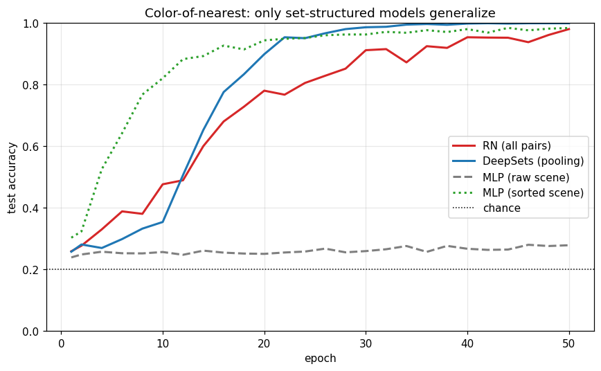
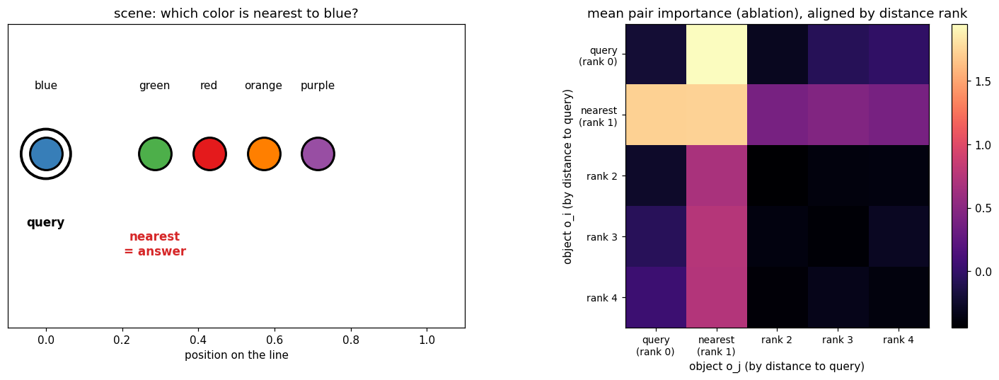

+++
date = '2026-06-05T09:00:00+08:00'
draft = false
title = 'Sutskever 30 #14：不挑了，每一对都算一遍'
description = '#13 的 MemN2N 用 attention 挑该读哪条事实。Santoro et al. 2017 的 Relation Networks 反着来：不挑——把每一对对象都过同一个小网络 g，全加起来，从这个和里读答案。一个极简但通用的关系推理模块，附带一个诚实的发现：在小任务上它并不比基线强，all-pairs 这层结构是给更难的问题买的保险。'
categories = ['AI', 'Sutskever 30']
tags = ['Sutskever 30', 'Relation Networks', 'Relational Reasoning', 'Attention', 'Permutation Invariance', 'End-to-End', 'Notebook Reading']
+++

## 从 #13 的"挑"接过来

[#13 Memory Networks](/posts/ai/sutskever-13-memory-networks/) 里，attention 干的是**挑**：用问题跟每条事实做匹配，挑出该读的那条；多跳是为了挑好几次，顺着事实链往下走。整条线（[#09 Bahdanau](/posts/ai/sutskever-09-bahdanau-attention/) 起）都在把"挑"做得更软、更可微。

Santoro、Raposo、Barrett 等人 2017 的 *A simple neural network module for relational reasoning*（模型常被叫 Relation Network，下面简称 RN）反过来问了一句：**能不能不挑？**

它的答案是：不挑。把每一对对象 `(o_i, o_j)` 都丢进同一个小网络 `g`，全部加起来，再用 `f` 从这个和里读出答案：

$$RN(O) = f_\phi\Big(\sum_{i,j} g_\theta(o_i, o_j, q)\Big)$$

没有 attention 权重，没有路由，没有"哪一对更重要"。所有对，一视同仁，各算一遍，求和。听起来很笨——可这一笨，恰好是后来 self-attention 的骨架。下面拆开看。

## 为什么"全算一遍 + 求和"够用

三件事撑起这个模块：

- **共享的 `g`**：一个 relation 就是"两个对象的函数"——这是先验。同一个 `g` 用在每一对上，参数少，而且强制模型把"关系"当成通用的东西，而不是给每对配一套。
- **求和 → 置换不变**：一堆对象本来没有先后顺序。先求和再读出，意味着打乱对象的排列，结果一个字都不变。
- **把问题 `q` 拼进每一对**：`g` 看的是 `(o_i, o_j, q)`，于是"关心哪种关系"由问题决定——同一组对象，问法不同，`g` 算出来的东西就不同。

读出那一步：

$$\hat a = \mathrm{softmax}\big(f_\phi(r)\big), \qquad r = \sum_{i,j} g_\theta(o_i, o_j, q)$$

跟 [#12 NTM](/posts/ai/sutskever-12-neural-turing-machine/) 那套 location addressing、erase/add 比，这里干净得不像话：两个 MLP，一次求和。论文标题里的 "simple" 不是谦虚。

## 一个最小任务：最近邻的颜色

光说没用，得有个非得用上关系才能答的任务。

demo 里把对象摆在一条线上，每个对象一个颜色、一个位置。问题是：**离 `c` 这个颜色最近的，是什么颜色？**

```
位置:  0      2      3      4      5
颜色: blue  green   red  orange purple
Q: 离 blue 最近的是什么颜色?  ->  green
```

要答对，必须把**两个**对象的属性绑在一起：`c` 的位置、别人的位置、别人的颜色。单看任何一个对象都答不出来——"最近"是一种成对的关系。颜色在每个场景里都不重复，所以颜色的直方图永远是平的，没有"猜最常见那个颜色"的捷径可走，瞎猜就是 1/5。

## 它自己学会了这个关系

notebook 里用纯 NumPy 写了 `g`、`f`（手推 backprop，有限差分梯度检验中位相对误差 `1.2e-6`），Adam 训 50 个 epoch。RN 测试准确率 **0.981**。



关键在于：**没有人告诉它该看 `c` 和最近的那个对象**。训练时只给了问题和答案，没标注"支撑这道题的是第 0 个和第 2 个对象"。这条成对的关系，是从问答对里靠反向传播自己长出来的——跟 #13 那条两步路由一样，端到端。

## 算了所有对，但只有一对在起作用

RN 把全部 `5×5=25` 对都算了。哪些对真在影响答案？做个 ablation：把某一对从求和里拿掉，看正确答案的 logit 掉多少——掉得越多，这对越重要。



把每个场景按"到 `c` 的距离排名"对齐（rank 0 是 `c` 自己，rank 1 是最近邻，往后越来越远）再平均，右图最亮的格子就是 **query × nearest** 这一对。全测试集上统计：最重要的那一对，**90.8%** 的情况下都涉及最近邻那个对象。

算了所有对，但承载答案的，是 `c` 跟它最近邻这一对。RN 没有 attention 那样显式地"挑"，可它学出来的效果，是让无关的对在求和里互相抵消、让相关的那一对冒出来。这张图，跟 #13 那张 attention 落点图说的是同一件事——只不过一个是"挑出来给你看"，一个是"全算了之后自己浮出来"。

## 诚实的部分：all-pairs 真比基线强吗

这里得说句实话。同一个任务、同一套训练，四个模型只差在架构上：

- **一个普通 MLP，把整个场景拍平喂进去**（对象按原始顺序排）：train `0.827` / test `0.279`。它在背训练集里对象的排列方式，没学会"这是一个集合"，一到测试就崩回瞎猜附近。
- 任何**把场景当集合看**的模型都学得会：RN `0.981`、给同一个 MLP 喂一个固定排序的场景也能到 `0.984`。

所以这个 demo 里真正的分水岭，是"有没有把输入当成一个集合来处理"。RN 用 all-pairs + 求和，把这件事直接内建了——它天生置换不变（打乱对象顺序，输出变化只有 `2.8e-14`，浮点级别）。

但更要诚实的是另一头：在这么小的任务上，连**不配对、只做 pooling** 的 DeepSets（`f(Σ_i g(o_i, q))`，没有任何成对计算）都能训到 **1.000**，比 RN 还好。pairwise 这层结构在这个玩具任务上根本不是必需的。它是给更难的关系准备的保险——论文在 CLEVR（带视觉、问题更绕）上，普通 MLP 只有约 `63%`，RN 到约 `94%`，那个差距才是 all-pairs 结构真正挣出来的。换句话说：这篇 demo 能让你看清 RN 长什么样、为什么置换不变、学到了什么，但 RN 比基线强多少，得换个更难的舞台才看得出来。这点跟 #12 NTM 一个味道——机制漂亮，优势要到够难的问题上才兑现。

## 这条路通向哪里

把 RN 摆在 attention 旁边，形状几乎重合：都是"在一组对象上，对每一对做点什么，再聚合"。

- **RN**：每一对过一个共享 MLP `g`，**等权**求和。
- **self-attention**：每一对做点积，softmax **加权**求和。

RN 是"所有对、不加权"的版本；attention 把加权又加了回来。顺着这条线看就很清楚：#13 的 attention 是"加权地挑"，RN 是"不加权地全算"，[Transformer](/posts/ai/sutskever-05-transformer/) 的 self-attention 则是"在所有对上做带学习权重的聚合"——正好是这两者的合体。RN 把"所有对都算一遍"这一刀切了出来，那一刀就是 self-attention 的骨架。

往应用那头，两条线在收口：#13 那条 content-addressed read 通向检索增强（RAG）；RN 这条 all-pairs interaction 通向 self-attention。Pointer、NTM、Memory Networks、Relation Networks，这几篇 2015–2017 的"attention 变体"，最后大多被 Transformer 一个结构吸收了进去。RN 这一篇的价值，是把"对一个集合里所有对象两两交互"这个想法，剥到了最干净。

## 代码

完整 notebook 在 [ZhenchongLi/sutskever-30-reading](https://github.com/ZhenchongLi/sutskever-30-reading)，是在原始的 `16_relational_reasoning.ipynb`（只有前向、未训练）上扩出训练后重跑的版本，文件 `16_relational_reasoning_rerun_20260605.ipynb`。

跑了五件事：

1. 一维最近邻问答任务：线上摆 5 个对象（位置 + 唯一颜色），问离 `c` 最近的是什么颜色——答对必须绑起两个对象的属性
2. 纯 NumPy 实现 RN：共享 `g` 跑所有对、求和、`f` 读出，附手推 backprop 的有限差分梯度检验
3. 训 RN 和三个基线（DeepSets、原始顺序 MLP、排序后 MLP），对比测试准确率曲线
4. 验证置换不变性：打乱对象顺序，RN 输出不变到浮点噪声级别
5. 用 ablation 量每一对的重要性，按距离排名对齐，看哪些对承载答案

---

### Run Metadata

- repo: [ZhenchongLi/sutskever-30-reading](https://github.com/ZhenchongLi/sutskever-30-reading)
- notebook: `16_relational_reasoning_rerun_20260605.ipynb`（在 `16_relational_reasoning.ipynb` 基础上加训练后重跑）
- 2026-06-05 执行通过（`jupyter nbconvert --to notebook --execute --ExecutePreprocessor.timeout=300`），无报错
- 关键输出：梯度检验中位相对误差 `1.2e-6`；测试准确率 RN `0.981` / DeepSets `1.000` / 原始顺序 MLP `0.279` / 排序 MLP `0.984`（瞎猜 `0.20`，majority `0.171`）；置换不变性 `max|Δlogit|` = `2.8e-14`；最重要的对涉及最近邻的比例 `0.908`
- Python `3.13.2` / NumPy `2.4.4` / Matplotlib `3.10.8`

### 怎么跑

```bash
cd ~/code/sutskever-30-implementations
jupyter lab 16_relational_reasoning_rerun_20260605.ipynb
```

选 kernel `Python (sutskever-30)`。

### 备注

- Santoro, Raposo, Barrett, Malinowski, Pascanu, Battaglia, Lillicrap 2017 *A simple neural network module for relational reasoning*（NeurIPS 2017，arXiv 1706.01427）是这一篇的原始论文，模型常被叫 Relation Network（RN）
- 原论文在 CLEVR（视觉问答）、Sort-of-CLEVR、bAbI 上验证：对象是 CNN feature map 的格子，或 LSTM 编码的句子，问题用 LSTM 编码。这篇 demo 是最小版——对象是 `(位置, 颜色)`、问题是 one-hot、任务合成、摆在一维线上，好让纯 NumPy 的小模型能干净地收敛
- 任务用"最近邻的颜色"而不是论文那种"最近邻的形状"，是因为颜色在每个场景里唯一、直方图是平的，没有"猜最常见"的捷径；如果问形状，基线能靠形状直方图蒙到约 `0.5`，把关系信号盖掉
- 普通 MLP 在这个 demo 上崩，主要是因为它对对象顺序敏感（不置换不变）——把场景按颜色排好序，同一个 MLP 就回到 `0.98`。论文的 MLP 基线在更难的 CLEVR 上崩，那才是关系推理本身的难度
- DeepSets（Zaheer et al. 2017）是 sum-pooling 的通用集合函数逼近器，在这个玩具任务上够用甚至更好；RN 多出来的成对结构，是留给更复杂关系的
- 一条线串下来：[Pointer Networks（#10）](/posts/ai/sutskever-10-pointer-networks/) 让 attention 当输出，[NTM（#12）](/posts/ai/sutskever-12-neural-turing-machine/) 让 attention 读写一块 memory，[Memory Networks（#13）](/posts/ai/sutskever-13-memory-networks/) 砍到只读、多跳，Relation Networks 把"挑"也砍了、改成所有对都等权算一遍。content-addressed read 这条通向 RAG，all-pairs interaction 这条通向 [Transformer](/posts/ai/sutskever-05-transformer/) 的 self-attention

---

$$\text{article}^* = \underset{\theta}{\arg\min}\ \mathcal{L}_{\text{lizcc}}(\theta), \quad \theta \in \lbrace\text{Joe, Weaver, Ruyi, Thorn}\rbrace$$
