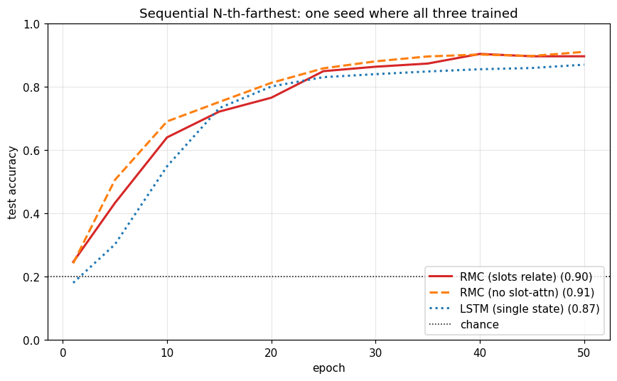
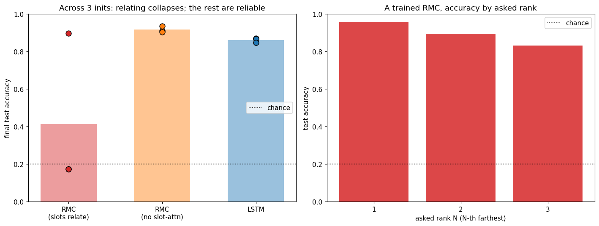

+++
date = '2026-06-07T09:00:00+08:00'
draft = false
title = 'Sutskever 30 #15：把注意力当记忆用，可惜很娇气'
description = '#14 的 Relation Network 把每一对对象等权求和。Santoro et al. 2018 的 Relational Memory Core 把这个和换成 softmax 加权（也就是 self-attention），再塞进一块循环记忆，让记忆槽每一步互相 attend。说到底它就是一个 Transformer block，被当成记忆的更新规则。我用纯 NumPy 写出来训了一遍，发现一件比 #14 更扎心的事：让槽互相 attend 这层，不但没换来准确率，还特别难训——多数随机初始化下直接塌到瞎猜。'
categories = ['AI', 'Sutskever 30']
tags = ['Sutskever 30', 'Relational RNN', 'Relational Memory', 'Self-Attention', 'Memory', 'BPTT', 'Notebook Reading']
+++

[#14](/posts/ai/sutskever-14-relation-networks/) 结尾留了个尾巴：RN 把每一对对象等权求和，差一步就是 self-attention——把等权换成 softmax 加权。Santoro 那帮人 2018 年的 *Relational Recurrent Neural Networks*（模型叫 Relational Memory Core，简称 RMC）就把这一步迈了出去，还顺手做了件事：把这套加权的 all-pairs 塞进一块循环记忆里。不是对输入对象两两算一次，而是养一组「记忆槽」，每来一个输入就让这些槽互相 attend、互相更新一遍。

拆到底，RMC 就是拿一个 Transformer block 当记忆的更新规则用。想法很漂亮。但我训下来最大的收获，是它在最小版里出乎意料地难伺候。

## 它长什么样

记忆是 `S` 个槽、每个宽 `D` 的一块矩阵 `M`。每来一个输入，嵌成一行 `e`，拼到记忆后面，然后对这 `S+1` 行做一个标准的 Transformer encoder block：

$$\tilde M = \mathrm{LN}\big(M + \mathrm{Attn}(M,\ [M; e])\big), \qquad M' = \mathrm{LN}\big(\tilde M + \mathrm{MLP}(\tilde M)\big)$$

attention 的 query 来自记忆槽，key 和 value 来自「槽加上这一步的输入」，所以一个槽既能读别的槽，也能读新来的输入。`M'` 就是下一步的记忆。整段序列走完，把最后的记忆拍平读出答案。跟 [#12 NTM](/posts/ai/sutskever-12-neural-turing-machine/) 那套手工设计的读写头比，这里没有专门的读写机制，记忆的更新规则就是 self-attention 本身——这也正是它跟 [#05 Transformer](/posts/ai/sutskever-05-transformer/) 的关系：同一个 block，Transformer 拿它当整个模型的主干，RMC 拿它当循环记忆的更新规则。

## 一个要记性的任务

[#14](/posts/ai/sutskever-14-relation-networks/) 问的是「线上离某颜色最近的是谁」，一次看全场景。这次改成顺序的，逼出记性：`K` 个对象一个个排在线上，一步喂一个（位置加编号）；全喂完，最后一步才给一个目标位置和一个名次 `N`，问离目标第 `N` 远的是哪个对象。

要答对，得先把所有对象记在记忆里（查询到最后才来），再按到目标的距离排个序、挑出第 `N` 个。位置取整数线槽，距离不打平，答案编号的直方图是平的，瞎猜就是 1/(K-1)。

手推 backprop（梯度穿过整段循环的 BPTT），有限差分检验中位相对误差 RMC 1.3e-10、LSTM 1e-9 出头。`K=6`、`N` 取 1 到 3、Adam 训 50 个 epoch。

## 训得起来，但只是有时候

挑一个能训起来的初始化，三个模型都学到了远超瞎猜（0.20）的程度：



注意上面那句限定词。换几个随机种子重训，画面就裂了。



同样的任务、同样的预算，只换初始化：单状态的 LSTM 稳，三次都在 0.86 上下；去掉槽间 attention 的 RMC（每个槽只能看自己和当前输入）更稳，0.92；而完整的 RMC——槽互相 attend 那版——三次里有两次直接塌到瞎猜（0.172），只有一次训了起来，平均 0.41，方差大得没法看。

所以这篇的结论比 [#14](/posts/ai/sutskever-14-relation-networks/) 还要难堪一层。#14 是「关系那层在玩具上没帮上忙」；这篇是「关系那层不但没帮忙，还把训练搞脆了」。它就训起来那一次，也不过追平了去掉它的版本。

## 为什么会塌

原因不难想。几个记忆槽一开始长得差不多，self-attention 第一步就是近似均匀的，把所有槽平均到一起；槽越来越像，梯度越来越平，整个网络卡在起步线动不了。这是 self-attention 自己的老毛病，rank collapse 的小型版。给每个槽不一样的初始化，把对称性打破，能救回来一部分（上面那次训起来的就是），但远谈不上稳。

公平起见得替原论文说句话：完整的 RMC 还带多头 attention 和一道 LSTM 式的门控，是我为了看清核心给砍了的，那些设计本身也在缓解这种脆弱。我这版砍到只剩单头、无门控，塌得格外明显。

## 这恰好是下一篇要解决的

把三篇摆一起，self-attention 的形状越来越清楚：[#14](/posts/ai/sutskever-14-relation-networks/) 是对一组对象每一对过共享 `g`、等权求和；RMC 是对一组记忆槽每一对做点积、softmax 加权求和，而且每步循环地做；[#05 Transformer](/posts/ai/sutskever-05-transformer/) 干脆把这套加权 all-pairs 当成整个模型的主干，连循环记忆都不要了。RMC 是中间那一环，把「加权的 all-pairs」从对输入算一次，升级成记忆的更新规则。

而它「一训就塌」的毛病，恰好是这条路上最要紧的工程。怎么把堆叠的 self-attention 训稳——normalization 摆哪、要不要 warmup、怎么初始化——正是后面 Transformer 真正解决的事；[#16](/posts/ai/sutskever-16-resnet/) 的残差连接也是这套解法里的一员。RMC 把 self-attention 请进了记忆，得有这些招数兜底，它才能当上主角。

往应用那头，两条线还在收口：content-addressed read（[#13](/posts/ai/sutskever-13-memory-networks/)）通向检索增强（RAG）；all-pairs interaction（[#14](/posts/ai/sutskever-14-relation-networks/) → RMC）通向 self-attention。

## 代码

完整 notebook 在 [ZhenchongLi/sutskever-30-reading](https://github.com/ZhenchongLi/sutskever-30-reading)，在原来只有前向、未训练的 `18_relational_rnn.ipynb` 上扩出训练后重跑，文件 `18_relational_rnn_rerun_20260607.ipynb`。里面跑了五件事：顺序第 N 远任务；纯 NumPy 实现 RMC（self-attention + LayerNorm + MLP + 残差，当记忆更新规则，带 BPTT 的梯度检验，RMC 和 LSTM 各检一遍）；在一个能训起来的初始化下训 RMC 和两个对照（LSTM、去掉槽间 attention 的 RMC）看训练曲线；换 3 个随机初始化重训，量关系那层到底带来准确率还是脆弱；在训起来那次按名次 N 拆开准确率，确认它真在排序。

---

### Run Metadata

- repo: [ZhenchongLi/sutskever-30-reading](https://github.com/ZhenchongLi/sutskever-30-reading)
- notebook: `18_relational_rnn_rerun_20260607.ipynb`（在 `18_relational_rnn.ipynb` 基础上加训练后重跑）
- 2026-06-07 执行通过（`jupyter nbconvert --to notebook --execute --ExecutePreprocessor.timeout=1200`），无报错
- 关键输出：梯度检验中位相对误差 RMC 1.3e-10 / LSTM 9.9e-10；3 个种子下的测试准确率——完整 RMC（槽互相 attend）0.41±0.34（其中 2 次塌到瞎猜 0.172）/ RMC 去掉槽间 attention 0.92±0.01 / LSTM 0.86±0.01（瞎猜 0.200）
- Python 3.13.2 / NumPy 2.4.4 / Matplotlib 3.10.8

### 怎么跑

```bash
cd ~/code/sutskever-30-implementations
jupyter lab 18_relational_rnn_rerun_20260607.ipynb
```

选 kernel `Python (sutskever-30)`。

### 备注

- Santoro, Faulkner, Raposo, Rae, Chrzanowski, Weber, Wierstra, Vinyals, Pascanu, Lillicrap 2018 *Relational Recurrent Neural Networks*（NeurIPS 2018，arXiv 1806.01822）是原始论文，模型叫 Relational Memory Core（RMC）
- 原论文的 RMC 用多头 attention（不同头学不同关系）加一道 LSTM 式门控（控制每步往记忆写多少）。这篇砍成单头、无门控的最小版，为的是看清「self-attention 当记忆更新规则」这个核心；代价是更脆，多头和门控本来也在帮着稳训练
- 那个「槽塌到一起」的坑值得单记一笔：几个槽初始化太像，self-attention 会把它们平均成一个，网络卡在瞎猜起步。这正是后来 Transformer 要靠 normalization 摆位、warmup、初始化来驯服的同一个毛病，也是为什么这一篇是通往 [Transformer](/posts/ai/sutskever-05-transformer/) 的关键一环
- 任务用「线上第 N 远」是为了呼应 [#14](/posts/ai/sutskever-14-relation-networks/) 的「线上最近」：一次看全场景改成顺序喂入，逼出对记忆的需求；一维距离也好让小模型学得动（论文里是 16 维向量、8 个、N 到 8，那个规模才看得出关系那层的价值）
- 一条线串下来：[Pointer Networks（#10）](/posts/ai/sutskever-10-pointer-networks/) 让 attention 当输出，[NTM（#12）](/posts/ai/sutskever-12-neural-turing-machine/) 让 attention 读写一块 memory，[Memory Networks（#13）](/posts/ai/sutskever-13-memory-networks/) 砍到只读多跳，[Relation Networks（#14）](/posts/ai/sutskever-14-relation-networks/) 把「挑」也砍了、改成所有对等权算一遍，Relational Memory 再把这个和加上权重、塞进循环记忆

---

$$\text{article}^* = \underset{\theta}{\arg\min}\ \mathcal{L}_{\text{lizcc}}(\theta), \quad \theta \in \lbrace\text{Joe, Weaver, Ruyi, Thorn}\rbrace$$
