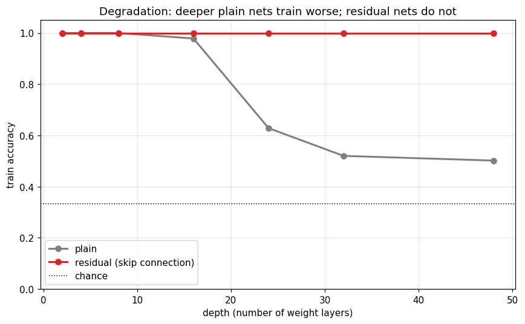
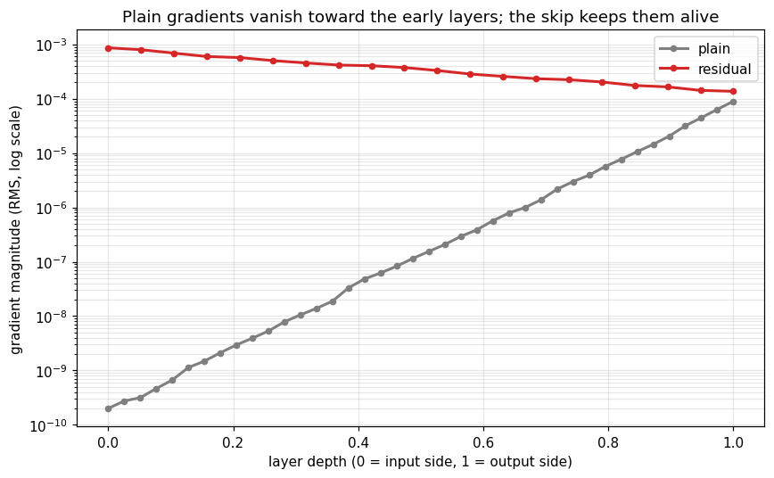

+++
date = '2026-06-08T09:00:00+08:00'
draft = false
title = 'Sutskever 30 #16：深网络越深越难训，ResNet 怎么解的'
description = '深网络有个反直觉的毛病：堆多了连训练误差都往上走，根本训不动。He 等人 2015 年的 ResNet 一行 y = x + F(x) 就解决了。我用纯 NumPy 把 plain 和残差两个深网络写出来各跑了一遍——plain 到四十几层就拟合不动，残差全程没事；梯度上，plain 在靠近输入的层掉了五个数量级，残差那根 skip 把它接住了。'
categories = ['AI', 'Sutskever 30']
tags = ['Sutskever 30', 'ResNet', 'Residual Learning', 'Vanishing Gradients', 'Deep Networks', 'BPTT', 'Notebook Reading']
+++

按说网络越深应该越强。再不济，多出来的层学成恒等映射，整个网络退回浅的，也不该更差。但真把一个普通深网络堆起来，事情是拧着的：过了某个深度，越加层越难训，连训练集都拟合不动，训练误差不降反升。He、Zhang、Ren、Sun 2015 年的 ResNet 针对的就是这个怪现象。

上一篇 [#15](/posts/ai/sutskever-15-relational-rnn/) 的 RMC 我训得挺狼狈，三个随机种子里两个直接塌到瞎猜，当时只甩了句「深层堆叠难训」就糊弄过去了。这篇算把那句话补完——它的解法，残差连接，如今每个 Transformer block 里都躺着一个。

## 残差块

改动很小。普通一层从头学一个变换，`h ← tanh(Wh)`；残差块学的是在原来基础上加多少：

$$h \leftarrow h + W_2\,\tanh(W_1 h)$$

`F` 没学到有用的东西就退回 0，这层自动成了恒等映射。「至少不会更差」这件事，被写进了结构里。

真正值钱的是反向。梯度经过一个残差块时，

$$\frac{\partial y}{\partial x} = I + \frac{\partial F}{\partial x}$$

`I` 那一项把上游梯度原样递回去。哪怕 `∂F/∂x` 已经小到忽略不计，梯度也跌不破这个 1。叠几十层，最前面那几层照样收得到信号。普通层没有这一项，它的梯度是几十个雅可比矩阵连乘的结果，乘着乘着就归零了。

## 在螺旋上跑一遍

我拿三条缠在一起的螺旋臂做二维分类。这任务浅网络随手就解，是我故意挑简单的：这样深网络一旦训不动，锅只能算在优化头上，跟任务难不难没关系。



两个网络宽度相同、权重层数也相同，唯一的区别是那根 skip 线。深度从 2 拉到 48：

| 深度（权重层数） | plain | 残差 |
|---|---|---|
| 8 | 1.000 | 1.000 |
| 16 | 0.978 | 1.000 |
| 24 | 0.628 | 1.000 |
| 32 | 0.520 | 1.000 |
| 48 | 0.502 | 1.000 |

浅的时候两边都满分。plain 过了 16 层开始掉，到 48 层只剩 0.5，离三分类瞎猜的 0.33 没多远了。这是训练准确率——它连自己浅的时候能轻松拟合的那批数据，现在都喂不进去了。残差网络参数一个不差，全程 1.0。

## 梯度去哪了

拿一个没训过的四十层网络做一次反向传播，量一下梯度传到每层时还剩多大。



plain 那条线在 log 轴上是直的，从输出端的 9e-5 一路滑到输入端的 2e-10，差了整整五个数量级。前面的层几乎收不到梯度，自然学不动。残差那条基本是平的，`I` 把梯度托住了。

手推的反向过了有限差分检验，plain 和残差的中位相对误差是 5.9e-8 和 5.1e-9（残差块反向别忘了把 skip 支路的梯度加回主路）。

[#03 的 LSTM](/posts/ai/sutskever-03-lstm/) 其实早用过同一招对付梯度消失：cell 状态一路加着往前走，门控只决定加多少。ResNet 把这个加性直通从时间方向搬到了深度方向，差不多就这点事。

## 几个边界

这个好处是深度逼出来的。浅网络根本不需要 skip，plain 和残差没差别——它的价值得深到梯度撑不住才显出来。

还有我得说清楚：我用 tanh 配小初始化，是为了把梯度消失这件事看得清楚。换成 ResNet 原文那套 ReLU + BatchNorm，单纯的梯度消失会轻很多，可退化照样发生——原文里梯度本来是健康的，深网络还是越深越差。所以 skip 干的不只是救梯度，它把优化的地形也整个捋平了一截，这层我在玩具上没复现。另外残差不多给任何容量，参数跟 plain 一样，它只管能不能训得动。

## 残差之后

深度一度是堵墙：理论上越深越强，实践里越深越训不动。ResNet 用一根 skip 把墙推平，之后几百上千层才成了常规操作。

这根线现在哪儿都是。[#15](/posts/ai/sutskever-15-relational-rnn/) 的记忆块里有它，[#05 Transformer](/posts/ai/sutskever-05-transformer/) 的每个 block 都是「attention + 残差 + LayerNorm」「MLP + 残差 + LayerNorm」摞起来的。少了残差和归一化，那种深度根本立不住。#15 给了想往上堆的东西，ResNet 给了堆得起来的办法。

## 代码

完整 notebook 在 [ZhenchongLi/sutskever-30-reading](https://github.com/ZhenchongLi/sutskever-30-reading)，在原来只有前向、未训练的 `10_resnet_deep_residual.ipynb` 上补了训练重跑，文件 `10_resnet_deep_residual_rerun_20260608.ipynb`。里面就四件事：螺旋分类任务、纯 NumPy 写的 plain 和残差两个深网络（带手推 backprop 的梯度检验）、从浅到深的深度扫描（看退化）、对没训练的深网络做一次反向（看梯度流）。

### Run Metadata

- repo: [ZhenchongLi/sutskever-30-reading](https://github.com/ZhenchongLi/sutskever-30-reading)
- notebook: `10_resnet_deep_residual_rerun_20260608.ipynb`（在 `10_resnet_deep_residual.ipynb` 基础上加训练后重跑）
- 2026-06-08 执行通过（`jupyter nbconvert --to notebook --execute --ExecutePreprocessor.timeout=600`），无报错
- 关键输出：梯度检验中位相对误差 plain `5.9e-8` / 残差 `5.1e-9`（worst 是接近零梯度、tanh 饱和处的有限差分噪声）；训练准确率随深度——plain `1.000`（8 层）→ `0.628`（24 层）→ `0.502`（48 层），残差全程 `1.000`（瞎猜 `0.333`）；40 层时最靠输入层的梯度 plain `2.0e-10` vs 残差 `8.7e-4`
- Python `3.13.2` / NumPy `2.4.4` / Matplotlib `3.10.8`

### 怎么跑

```bash
cd ~/code/sutskever-30-implementations
jupyter lab 10_resnet_deep_residual_rerun_20260608.ipynb
```

选 kernel `Python (sutskever-30)`。

### 备注

- He, Zhang, Ren, Sun 2015 *Deep Residual Learning for Image Recognition*（CVPR 2016，arXiv 1512.03385）是原始论文；后续的 *Identity Mappings in Deep Residual Networks*（He et al. 2016，arXiv 1603.05027）把「为什么恒等的 skip 最好」讲得更透，本文那条 `∂y/∂x = I + ∂F/∂x` 就是它的核心论证
- 原论文是 CNN 做 ImageNet，残差块里是卷积加 BatchNorm；这篇是最小版，全连接、tanh、二维螺旋，为的是让纯 NumPy 的深网络干净地复现退化和梯度消失
- tanh 加小初始化是为了把梯度消失显出来。现代 ReLU 加合适初始化下纯梯度消失轻很多，但退化在 ReLU + BatchNorm（梯度健康）时依然存在——skip 不只是救梯度，更改善了优化地形，这点玩具上没单独复现
- 一条线串下来：[#15 Relational Memory](/posts/ai/sutskever-15-relational-rnn/) 想把 self-attention 堆成深层记忆却很脆弱，ResNet 这根 skip（配上归一化）正是让深层堆叠训得动的关键；今天 [Transformer](/posts/ai/sutskever-05-transformer/) 的每个 block 都立在残差加 LayerNorm 上

---

$$\text{article}^* = \underset{\theta}{\arg\min}\ \mathcal{L}_{\text{lizcc}}(\theta), \quad \theta \in \lbrace\text{Joe, Weaver, Ruyi, Thorn}\rbrace$$
