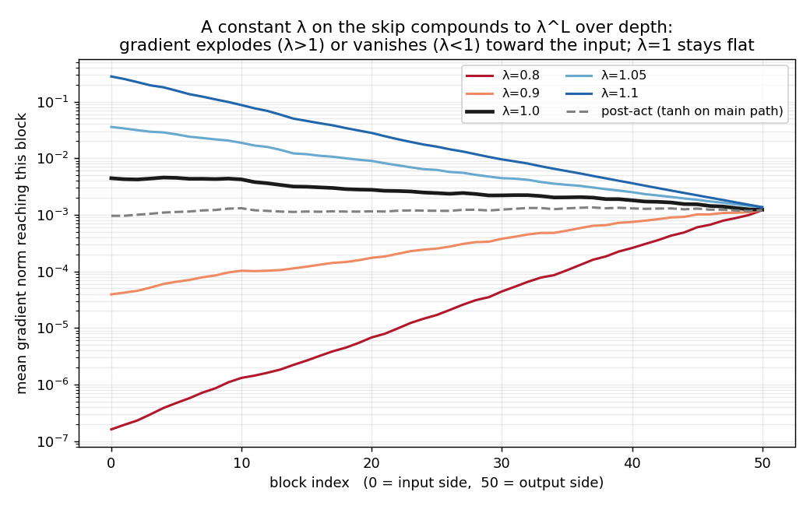
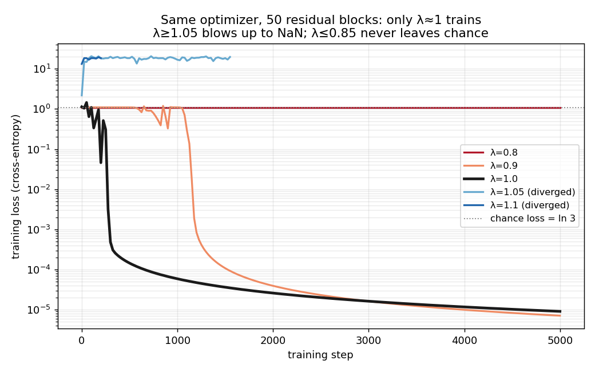

+++
date = '2026-06-11T09:00:00+08:00'
draft = false
title = 'Sutskever 30 #17：残差的 skip 上不能随便乘个数'
description = '#16 那根 skip 是个干净的 +x。He 等人 2016 年的后续论文较真问：非得干净吗？我用纯 NumPy 把 skip 改成 λ·x + F(x)，扫了一圈 λ——50 个残差块、同一个优化器，λ=1 训到满分，λ=0.9 磨半天也能进去，λ≤0.85 卡在瞎猜，λ≥1.05 直接 NaN。病根是 skip 上那个常数会沿深度乘成 λ^L：λ=1.1 时传到最前面的梯度是输出端的两百倍，λ=0.8 时只剩万分之一。skip 当初就是来消灭这种沿深度连乘的，你给它乘个数，连乘又回来了。'
categories = ['AI', 'Sutskever 30']
tags = ['Sutskever 30', 'Identity Mappings', 'Pre-activation', 'ResNet', 'Residual Learning', 'Vanishing Gradients', 'Exploding Gradients', 'Deep Networks', 'Notebook Reading']
+++

[#16](/posts/ai/sutskever-16-resnet/) 结尾我说那根 skip 现在到处都是，每个 Transformer block 里都躺着一个。那篇把它当成一个干净的 `+x` 用。可它真得是 `+x` 吗？把它换成 `+0.9·x` 或者 `+1.1·x`，差这么一点，按说无所谓。He、Sun 他们 2016 年的后续论文（Identity Mappings）专门为这点较了真，结论是差这一点，深网络就重新训不动了。原因还是那个老问题——你又在沿着深度乘东西了，而 skip 当初就是为了让你别再乘。

## 给 skip 乘上一个数

干净的残差块是 `x ← x + F(x)`。一路堆上去，第 `l` 层到第 `L` 层之间，主干就是一串加法：

$$x_L = x_l + \sum_{i=l}^{L-1} F(x_i)$$

反向也就跟着干净。`x_l` 收到的梯度是

$$\frac{\partial x_L}{\partial x_l} = I + \sum_{i=l}^{L-1}\frac{\partial F(x_i)}{\partial x_l}$$

那个 `I` 就是 [#16](/posts/ai/sutskever-16-resnet/) 里反复说的直通线，梯度原样递回去，不管中间几十层。

现在在 skip 上压个常数 `λ`，块变成 `x ← λ·x + F(x)`。把它展开，主干上每过一块就多乘一次 `λ`，到第 `L` 层：

$$x_L = \lambda^{\,L-l}\, x_l + \cdots$$

梯度也一样，`x_l` 那一项前面挂上了 `λ^{L-l}`。`λ` 只要不等于 1，这就是深度的指数。50 层下来，`λ=1.1` 是 `1.1^50 ≈ 117`，`λ=0.8` 是 `0.8^50 ≈ 1.4e-5`。skip 本来是用那个 `I` 把连乘掐断的，你给它乘个 0.9，连乘原封不动地回来了。

## 梯度的扇形

先不训练，拿一个随机初始化的 50 块网络做一次反向，量梯度传到每一层时还剩多大。



所有线在输出端（右边）是齐的，梯度从那儿进来。往输入端走就散开成一把扇子。`λ=1.1` 那条往上翘，传到最前面是输出端的两百倍；`λ=0.8` 那条往下栽，到最前面只剩万分之一，前面几十层基本收不到信号。`λ=1` 那条几乎是平的。扇子张开的速度就是 `λ^{L-l}`（实测比纯 `λ^L` 高个两三倍，因为残差支路自己也往回灌了一点梯度，但趋势分毫不差）。

灰色那条虚线先放一放，等会儿说。

## 训练时会怎样

把网络真训起来，三环分类，七个 `λ` 各跑一遍，优化器、初始化、步数全一样，只动 skip 上那个系数。



| `λ` | 训练结果 |
|---|---|
| 0.80 | 准确率 0.34（瞎猜是 0.33） |
| 0.85 | 0.33 |
| 0.90 | 1.00 |
| 0.95 | 1.00 |
| 1.00 | 1.00 |
| 1.05 | 第 1554 步 NaN |
| 1.10 | 第 218 步 NaN |

`λ=1` 三百步就压到底了。`λ=0.9` 最后也满分，但磨蹭到一千一百步才肯起来——前面的层梯度太弱，半天没动静，得等顶上的层先把活干起来。`λ=0.8`、`0.85` 干脆卡在瞎猜：前向信号衰减得太狠，输入还没爬到顶层就所剩无几，顶层拿到的几乎是噪声，没东西可学。另一头，`λ≥1.05` 直接发散，越大崩得越早，`λ=1.1` 两百来步就 NaN 了。

这个窗口是偏的。往小了走还能磨进去，往大了走立刻就死——爆炸是乘出来的正反馈，权重一大、激活更大、梯度更大，一步就失控；消失至少是安静地烂掉，顶上几层还能替前面兜着。

准确率这张表其实藏了点东西。三环这任务浅网络随手就解，所以 `λ=0.9` 哪怕前面四十多层基本没参与，光靠顶上几层也把它拟合了。准确率把伤情盖住了，真正的伤在上面那张梯度图里，不在这张表里。（这跟 [#14](/posts/ai/sutskever-14-relation-networks/)、[#15](/posts/ai/sutskever-15-relational-rnn/) 撞的是同一堵墙：玩具任务不挑架构，你想暴露的毛病它未必逼得出来。）我把网络堆到 50 层、`λ` 一路推到 0.8，就是因为浅一点、近一点，这些区别根本显不出来。

## 真正的修法是把 skip 腾空

知道了病根，顺手的想法是把 `λ` 卡在 1 附近就完事。论文没走这条路，它的办法更绝：skip 上什么都别放。

原始 ResNet 的块，加法之后还跟着一个 ReLU：`y = ReLU(x + F(x))`。这个 ReLU 蹲在主干上，块一堆起来，主干就不再是那串干净的加法了，每过一块都被它捏一下。后续这篇把 BN 和 ReLU 全挪进 `F` 里头（`BN → ReLU → 权重` 这个顺序，所以叫 pre-activation），加法之后一无所有，块和块之间是一条赤裸的求和。

上面那条灰虚线就是我把激活搬到主干上试的：`x ← tanh(x + F(x))`。梯度确实往输入端掉，只是 tanh 配上小初始化掉得温和，没到崩盘的地步，三环它照样拟合。换成 ReLU、堆到上千层，这点温和的损耗会放大成训不动。往 skip 上乘个常数是弄脏主干的一种方式，往主干上压个非线性是另一种，病根一个样：只要主干不是恒等，沿深度的连乘就回来了。

## 一条赤裸的主干

这条求和主干，就是今天大模型的长相。Transformer 每个 block 是 `x ← x + attention(x)`、`x ← x + mlp(x)`，残差流从输入一路加到输出，中间没人往上乘系数，也没人压激活，归一化全待在分支里。[#05](/posts/ai/sutskever-05-transformer/) 当时只说每个 block 立在「残差 + LayerNorm」上，没细究为什么 LayerNorm 偏偏放分支、主干必须空着——这篇就是那个为什么。

[#16](/posts/ai/sutskever-16-resnet/) 说深网络得加一根 skip。这篇说加完别去碰它，差 0.1 都不行。

## 代码

完整 notebook 在 [ZhenchongLi/sutskever-30-reading](https://github.com/ZhenchongLi/sutskever-30-reading)，在原来只有前向、没训练的 `15_identity_mappings_resnet.ipynb` 上补了手推反向和训练重跑，文件 `15_identity_mappings_resnet_rerun_20260611.ipynb`。里面四件事：三环分类任务、纯 NumPy 写的深残差 MLP（skip 带可调系数 `λ`，带手推 backprop 的梯度检验）、50 个未训练块里前向和反向信号怎么随 `λ` 扇开、固定优化器扫 `λ` 训练看谁还训得动。

### Run Metadata

- repo: [ZhenchongLi/sutskever-30-reading](https://github.com/ZhenchongLi/sutskever-30-reading)
- notebook: `15_identity_mappings_resnet_rerun_20260611.ipynb`（在 `15_identity_mappings_resnet.ipynb` 基础上加手推反向与训练后重跑）
- 2026-06-11 执行通过（`jupyter nbconvert --to notebook --execute --ExecutePreprocessor.timeout=600`），无报错
- 关键输出：梯度检验中位相对误差 `5e-9`–`1e-8`（最差 `~1e-5`，出在接近零梯度、tanh 饱和处的有限差分噪声）；50 块未训练网络，输入/输出梯度比——`λ=0.8` `1.3e-4`、`λ=1.0` `3.6`、`λ=1.1` `204`（对应 `λ^50` 为 `1.4e-5` / `1.0` / `117`）；训练满分窗口 `λ∈[0.9,1.0]`，`λ≤0.85` 停在瞎猜，`λ=1.05`/`1.1` 分别在第 `1554`/`218` 步发散
- Python `3.13.2` / NumPy `2.4.4` / Matplotlib `3.10.8`

### 怎么跑

```bash
cd ~/code/sutskever-30-implementations
jupyter lab 15_identity_mappings_resnet_rerun_20260611.ipynb
```

选 kernel `Python (sutskever-30)`。

### 备注

- He, Zhang, Ren, Sun 2016 *Identity Mappings in Deep Residual Networks*（arXiv 1603.05027）是 ResNet 原文的后续；正文那条 `∂x_L/∂x_l = λ^{L-l} I + …` 是它的核心论证。论文还试了在 skip 上放 gating、`1×1` 卷积、dropout 等等，全都不如干净的恒等——道理都一样，主干上多任何东西，沿深度的连乘就回来了
- 玩具是全连接 + tanh + 二维三环；原文是 CNN 做 ImageNet，残差块里是卷积加 BatchNorm，pre-activation 的好处在上千层时才彻底显出来，这里只取最小可复现的核
- 梯度消失这半边在三环上被任务的「浅」盖住了：`λ<1` 还能靠顶层兜底拟合，伤显在前向/反向信号（第一张图），不显在准确率。要看清楚得把网络堆深、`λ` 推远
- 一条线串下来：[#16](/posts/ai/sutskever-16-resnet/) 给了「深网络得加一根 skip」，这篇给了「这根 skip 必须是干净的恒等」；今天 [Transformer](/posts/ai/sutskever-05-transformer/) 那条从头加到尾、谁都别碰的残差流，正是这条结论的样子

---

$$\text{article}^* = \underset{\theta}{\arg\min}\ \mathcal{L}_{\text{lizcc}}(\theta), \quad \theta \in \lbrace\text{Joe, Weaver, Ruyi, Thorn}\rbrace$$
