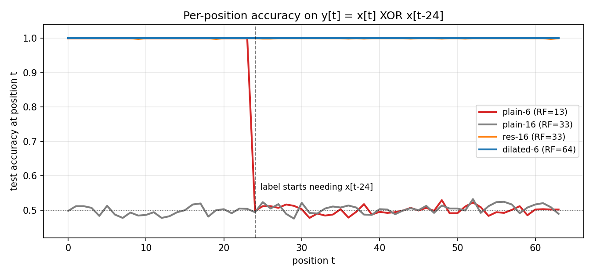
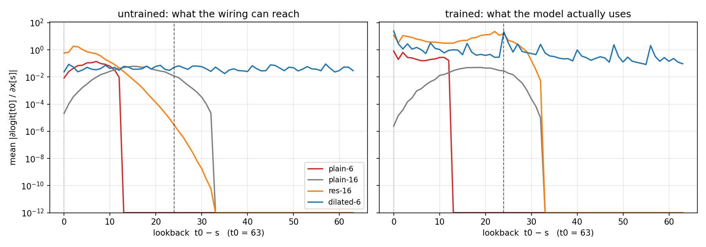

+++
date = '2026-06-13T09:00:00+08:00'
draft = false
title = 'Sutskever 30 #18：卷积看不到的地方，再怎么训也是抛硬币'
description = '我给四个一维因果卷积网络出了同一道题：y[t] = x[t] XOR x[t-24]。感受野只有 13 的那个，准确率曲线在 t=24 处断崖式掉到 0.5，训多久都一样——那一位它物理上看不到。Yu & Koltun 2016 的空洞卷积用六层就把感受野撑到 64，参数还是四个模型里最少的，每个种子都在两个 epoch 内解掉远端依赖。顺带撞见一个更细的事：感受野够得着，不等于梯度走得到。'
categories = ['AI', 'Sutskever 30']
tags = ['Sutskever 30', 'Dilated Convolutions', 'Receptive Field', 'WaveNet', 'CNN', 'Dense Prediction', 'Notebook Reading']
+++

先说实验。一条长 64 的随机 0/1 序列，每个位置都要答一道题：`y[t] = x[t] XOR x[t-24]`（前 24 个位置没有过去，答案就是 `x[t]` 本身）。四个一维因果卷积网络，通道数、优化器、数据全一样，只有接线不同。其中感受野最小的那个训完之后，把每个位置的测试准确率单独画出来，是这样：



红线在 `t=24` 那里直接断崖。前 24 个位置全对——那段答案就是当前位，谁都会。从 `t=24` 起，答案开始依赖 24 步之前的那一位，而这个网络的感受野只有 13：往回第 24 位在它的视野外面。视野外的位跟视野内的一切统计独立，所以它能做的最好的事就是抛硬币。0.688 的总准确率也没什么可调的：`24/64 × 1.0 + 40/64 × 0.5 = 0.6875`，到顶了。

我喜欢这个断崖的地方在于它干净。前几篇的瓶颈都软乎乎的——梯度小了、训练慢了、种子背了——这次是信息论意义上的墙：看不到就是看不到，损失函数上不存在任何下降方向能把那一位变出来。为了确认墙是真的，我做了个更狠的检查：拿一个网络，把输入里恰好在感受野边界外一位的那个 bit 翻转，输出 logit 的变化是精确的 0.0，不是 1e-8，是 0。翻边界内一位的，logit 就动了。

## 感受野是接线时定死的算术

因果卷积一层的输出是

$$y_t = b + \sum_{j=0}^{k-1} W_j\, x_{t - j\cdot d}$$

`k` 是核宽，`d` 是 dilation——卷积核的几个 tap 之间隔多远。`d=1` 是普通卷积，`d=2` 就是隔一个取一个。每过一层，感受野长 `(k-1)·d`，整个网络能看多远就是 `1 + Σ(k-1)·d`，一道小学算术，训练动不了它一毫米。

四个模型的算术：

| 模型 | 层数 | 核宽 | dilation | 感受野 | 参数 |
|---|---|---|---|---|---|
| plain-6 | 6 | 3 | 全是 1 | 13 | 4001 |
| plain-16 | 16 | 3 | 全是 1 | 33 | 11841 |
| res-16 | 16 | 3 | 全是 1，带残差 | 33 | 11841 |
| dilated-6 | 6 | 2 | 1,2,4,8,16,32 | 64 | 2705 |

plain-6 就是上面断崖那个。要用普通卷积够到 24 步之外，就得把这个线性增长堆够本——16 层，感受野 33，参数翻到近三倍，这是 plain-16 和 res-16。而 dilated-6 是 Yu & Koltun 2016 那篇 *Multi-Scale Context Aggregation by Dilated Convolutions* 的玩法：每层 dilation 翻倍，感受野指数地长，六层、每层只有两个 tap，就把整条序列罩住了，参数还是四个里最少的。空洞卷积不加参数、不加层，加的只是 tap 之间的空隙。

他们的原始问题是语义分割：每个像素都要一个标签，所以不能用 pooling——pooling 扩大视野的代价是把分辨率踩没了，对密集预测是致命的。空洞卷积给出第三条路：视野指数涨，分辨率一个像素不丢。我这个一维任务是同一件事的最小版：每个位置都要答案（密集预测），答案需要远处的上下文（大视野），两头都不能妥协。

## 四个网络训出来什么样

统一协议：4096 条训练序列，Adam，25 个 epoch。看总准确率和「远端」准确率（`t≥24`，需要回看的那部分）：

| 模型 | 总准确率 | 远端 |
|---|---|---|
| plain-6 | 0.688 | 0.500 |
| plain-16 | 0.502 | 0.505 |
| res-16 | 1.000 | 1.000 |
| dilated-6 | 1.000 | 1.000 |

plain-6 顶在天花板上，前面说过了。真正惨的是 plain-16：它感受野够（33 > 24），但 16 层普通卷积根本训不动，连前 24 个位置那道送分题都没学会——换了三个种子、两档学习率，六次全趴在 0.5。这面墙 [#16](/posts/ai/sutskever-16-resnet/) 写过，degradation：plain 网络堆到这个深度，优化先死了。给它装上残差（res-16，照 [#17](/posts/ai/sutskever-17-identity-mappings/) 的规矩 skip 上什么都不放），同样 16 层就活了过来。

所以走线性增长这条路，你先付三倍参数，再付一根 skip，才换到一个 33 的感受野。dilated-6 六层 2705 个参数，视野 64。

## 够得着，不等于走得到

本来写到上面就可以收了，但 res-16 的训练曲线里有个东西值得抠。它前 10 个 epoch 一直停在 0.68 附近——plain-6 那个天花板——像是先把送分题做完，远处那一位要到第 25 个 epoch 才突然找到。我多跑了两个种子，40 个 epoch 的预算内压根没找到，远端准确率停在 0.5 附近。而 dilated-6 三个种子全部在第 2 个 epoch 之内解掉远端。

差别在路径长度。res-16 的感受野 33 罩得住 24 没错，可从 `x[t-24]` 走到 `y[t]`，信号要穿过 12 层 dilation=1 的卷积，每层挪两步；dilated-6 里同一段距离两三跳就到（16+8=24，正好踩在 tap 上）。这条路一开始有多细，画出来一目了然——对没训和训好的网络，量 `|∂logit[63]/∂x[s]|` 随回看距离的衰减：



左边是没训的：纯接线。plain-6 在回看 12 之外是精确的零（又是那面墙），plain/res-16 在 32 之外归零。更要命的是归零之前——res-16 的梯度从回看 0 往回看 24 一路指数掉下去，差了六个数量级上下：路是通的，但起跑时细得像头发丝，credit assignment 得靠运气才摸得到。dilated-6 那条线整个是平的，回看 63 和回看 0 一个量级。右边是训完的：dilated-6 在回看 24 处立起一个尖，top-2 的梯度质量正好落在回看 0 和 24 上——任务定义里就这两个输入有用——两处合计占总质量的 48%，是均匀分布（2/64）的十五倍。这跟 [#14](/posts/ai/sutskever-14-relation-networks/) 里 ablation 找出「真正干活的那一对」是同一类画面：端到端训练自己把功劳算清楚了，只是这回没抵消得那么干净，其余 tap 上还留着一层没用完的底子。

所以这篇的教训其实有两层。粗的一层：感受野是硬约束，够不着就是抛硬币。细的一层：够得着也分怎么够——同样罩住 24 步，12 跳的细路和 2 跳的粗路，训练难度差出一个量级（epoch 2 对 epoch 25，还得碰运气）。空洞卷积两件事一起买：视野指数涨，路径对数短。

## 这招后来去了哪

2016 年底 WaveNet 拿同一个结构生成原始音频：16kHz 的波形，长程结构要回看几百上千步，普通卷积按线性增长得堆几百层，dilated 因果卷积一组 1,2,4,…,512 十层搞定，叠几组就是几千步的视野。后来 TCN 把这套打包成序列建模的通用配方（dilated + 因果 + 残差，正好是这篇 demo 里 dilated-6 加上 res-16 的 skip）。

跟这个系列前面的线对一下：attention（[#09](/posts/ai/sutskever-09-bahdanau-attention/) 起）解决长程的办法是按内容直接寻址，一跳到位，代价是每步都要对全序列算权重；空洞卷积是按位置铺设固定的稀疏接线，代价是视野再大也是定死的几何。[Transformer](/posts/ai/sutskever-05-transformer/) 最后选了前者当主干，但 dilated conv 这支没死——长序列模型里它一直是「便宜地拿大视野」的标准件。#16、#17、#18 这三篇连起来是卷积时代的两个根本约束：深度上的优化墙用 skip 拆，宽度上的视野墙用 dilation 拆。

## 代码

完整 notebook 在 [ZhenchongLi/sutskever-30-reading](https://github.com/ZhenchongLi/sutskever-30-reading)，在原来只有前向演示的 `11_dilated_convolutions.ipynb` 上补了手推反向和训练，文件 `11_dilated_convolutions_rerun_20260613.ipynb`。里面六件事：长程 XOR 密集预测任务；带 dilation 的因果一维卷积（手推 backward，梯度检验分线性网络全参数精确版和 ReLU 网络抽样版）；感受野硬边界检查（翻转边界外一位，logit 精确不动）；统一协议训四个模型；逐位置准确率和输入梯度回看分布两张图；3 个种子量 res-16 和 dilated-6 各自找到远端依赖要几个 epoch。

---

### Run Metadata

- repo: [ZhenchongLi/sutskever-30-reading](https://github.com/ZhenchongLi/sutskever-30-reading)
- notebook: `11_dilated_convolutions_rerun_20260613.ipynb`（在 `11_dilated_convolutions.ipynb` 基础上加手推反向与训练）
- 2026-06-13 执行通过（`jupyter nbconvert --to notebook --execute --ExecutePreprocessor.timeout=1200`），无报错
- 关键输出：梯度检验——线性网络全部 57 个参数中位 `7.9e-10`、最差 `1.8e-8`（精确检验，ReLU 换成恒等后有限差分无拐点噪声），ReLU 网络抽样中位 `5.3e-9`（最差被 ReLU 拐点的差分噪声污染，不作数）；感受野硬边界——翻转回看 13 的位 `max|Δlogit| = 0.000e+00`，回看 12 的位 `1.7e-2`；测试准确率（总/远端）plain-6 `0.688/0.500`、plain-16 `0.502/0.505`、res-16 `1.000/1.000`、dilated-6 `1.000/1.000`；远端解掉的 epoch——dilated-6 三种子 `2/1/2`，res-16 三种子 `25/未解/未解`（40 epoch 预算）；训后 dilated-6 梯度质量 top-2 落在回看 `{0, 24}`，合计占比 `0.481`
- Python `3.13.2` / NumPy `2.4.4` / Matplotlib `3.10.8`

### 怎么跑

```bash
cd ~/code/sutskever-30-implementations
jupyter lab 11_dilated_convolutions_rerun_20260613.ipynb
```

选 kernel `Python (sutskever-30)`。

### 备注

- Yu & Koltun 2016 *Multi-Scale Context Aggregation by Dilated Convolutions*（ICLR 2016，arXiv 1511.07122）是原始论文，场景是语义分割：在 VGG 前端后面接一个 context module，3×3 卷积 dilation 按 1,1,2,4,8,16,1 排，分辨率不降地聚合多尺度上下文。dilated/atrous 卷积的算子本身更早就有（à trous 小波），这篇把它立成了密集预测的标准件
- 这里的 demo 是一维因果版，等于把场景从分割换成了 WaveNet（van den Oord et al. 2016，arXiv 1609.03499）那种序列建模——算子一样，墙也一样。TCN（Bai et al. 2018，arXiv 1803.01271）里 dilated 因果卷积加残差的配方，跟这篇 demo 里 dilated-6 + res-16 的组合一一对应
- plain-16 训不动是 [#16](/posts/ai/sutskever-16-resnet/) 的 degradation 在 1D 卷积上原样复现，不是本篇任务特有的；res-16 的 skip 照 [#17](/posts/ai/sutskever-17-identity-mappings/) 的规矩留干净
- res-16 「够得着但难找到」那段是单数据集小模型上的观察（3 个种子），定性结论（路径越长越难做 credit assignment）跟 WaveNet/TCN 选 dilation 的动机一致，定量数字别往大模型上外推
- 任务里 `D=24` 故意选在 res-16 感受野（33）以内、plain-6（13）以外，这样三种失败各有各的原因：plain-6 输在信息，plain-16 输在优化，res-16 输在路径长度——只有最后一个是「训练运气」，前两个换多少种子都一样

---

$$\text{article}^* = \underset{\theta}{\arg\min}\ \mathcal{L}_{\text{lizcc}}(\theta), \quad \theta \in \lbrace\text{Joe, Weaver, Ruyi, Thorn}\rbrace$$
